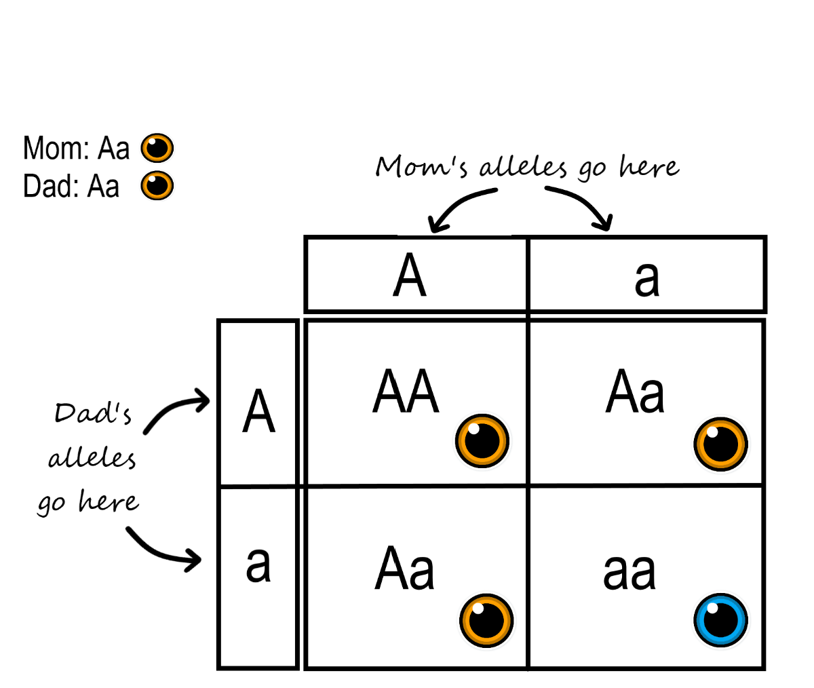

```{r setup, include=FALSE}
knitr::opts_chunk$set(echo = FALSE, 
                      message = FALSE, 
                      warning = FALSE, 
                      fig.align = "center", 
                      out.width = "60%")

library(tidyverse)
library(openintro)
library(mosaic)
library(moderndive)
library(pander)
library(infer)
library(janitor)
library(praise)
library(lterdatasampler)
library(palmerpenguins)
```

\begin{center}
\large{Name:} \underline{\hspace{3in}}
\vspace{0.25cm}

\large{Section (circle one):} \hspace{1cm} 8:10am \hspace{2cm} 9:10am 

\end{center}

\vspace{0.8cm}

\noindent {\bf Read and Sign the Following Statement:}

I understand that give or receiving help on this exam is a violation of academic
regulations and is punishable by a grade of __F__ in this course. This
includes looking at other students' exams and / or allowing other students,
actively or passively, to see answers on my exam. This also includes revealing,
actively or passively, any information about the exam to any member of 
Professor Theobold's STAT 218 class who has not yet taken the exam. The use of 
cell phones is strictly prohibited.

\begin{center}

\textbf{I pledge not to do any of these things.}

\vspace{0.5cm}

\textbf{Signed:} \underline{\hspace{4in}}

\end{center}

\vspace{1cm}

\noindent {\bf \textsf{Instructions.}}

\begin{itemize}
\item Read and sign the honesty pledge at the top of this page. Your exam will
not be graded unless the honesty pledge is signed!
\item You may use a calculator. You \textbf{may not} use your phone or any
device that connects to the internet as a calculator. \\
\item Show all work as clearly as possible. Point totals are shown in brackets 
next to each part. Formulas without values entered do not count as work. \\
\item All answers should be reported in decimal form, rounded to three decimal
places. \\
\item For multiple choice and multi-select problems, completely fill in the
provided circle (multiple choice) or square (multi-select) for your desired
answer choice(s). If you change an answer, be sure to completely erase your
initial selection.
\item You have 2 hours and 50 minutes to complete this exam, which is ample
time! If you get stuck on a problem, take a deep breath, say something positive
about yourself, and write down what you know.      
\end{itemize}

\pagebreak

## Golden Ticket

| Scenario | One Categorical Response | Two Categorical Variables | One Quantitative Response | Two Quantitative Variables | Quant. Response and Categ. Explanatory | 
|------------|:---------------------------:|:--------------------------:|:---------------------------------------:|:--------------------------:|:---------------------:|
| Type of plot | Bar plot | Dodged Bar plot, Stacked Bar plot, Filled Bar plot | Dot plot, Histogram, Boxplot | Scatterplot | Faceted Histograms, Side-by-side Boxplots |
|           |           |           |           |           |           |
| Summary measure | Proportion | Difference in Proportions | Mean | Slope or Correlation | Difference in Means |
|           |           |           |           |           |           |
| Parameter notation | $\pi$ | $\pi_1 - \pi_2$ | $\mu$ | Slope: $\beta_1$; Correlation: $\rho$ | $\mu_1 - \mu_2$ |
|           |           |           |           |           |           |
| Statistic notation | $\widehat{p}$ | $\widehat{p}_1 - \widehat{p}_2$ | $\bar{x}$ | Slope: $b_1$; Correlation: $r$ | $\bar{x}_1 - \bar{x}_2$ | 
|           |           |           |           |           |           |
| Statistical Method(s) | $\chi^2$ Goodness of fit Test | $\chi^2$ Test of Independence, $\chi^2$ Test of Homogeneity, Permutation Test | $t$-test for One Mean, $t$-test for Paired Differences, Bootstrap Confidence Interval for One Mean | $t$-test for $\beta_1$, Permutation Test for $\beta_1$, Bootstrap Confidence Interval for $\beta_1$ | $t$-test for $\mu_1 - \mu_2$, Permutation Test for $\mu_1 - \mu_2$, Bootstrap Confidence Interval for $\mu_1 - \mu_2$ |
|           |           |           |           |           |           |

\newpage

## Provided Formulas

$$IQR = Q3 - Q1$$

\vspace{0.25cm}

__1.5 IQR Rule:__ above $Q3 + (1.5 \times IQR)$  or below $Q1 - (1.5 \times IQR)$

\vspace{0.25cm}

$$\hat{y} = b_0 + b_1 \times x$$

\vspace{0.2cm}

$$Residual = y - \hat{y}$$ 

\vspace{0.3cm}

__t-based confidence interval:__ \hspace{1cm} $\text{point estimate} \pm t^*_{df} \times SE$

\vspace{0.25cm}

$$SE(\mu) = \frac{\sigma}{\sqrt{n}}$$
\vspace{0.25cm}

$$SE(\mu_1 - \mu_2) = \sqrt{\frac{\sigma_1^2}{n_1} + \frac{\sigma_2^2}{n_2}}$$

$$ 
X^2 = \sum \frac{(\text{observed} - \text{expected})^2}{\text{expected}} 
$$

\newpage 


\begin{center}
\textbf{\Large{Midterm 1 Question Bank}}
\end{center}
<!-- Questions 1-12 -->
<!-- Picked for midterm 1: 7, 9, 5, 3, 2 -->

\noindent \textbf{Q9} [1 point] When you change from a 90% to a 95% confidence
interval,which part(s) of the confidence interval change? (Select all that 
apply)

\begin{itemize}
\item[(a)] Statistic (midpoint)
\item[(b)] Multiplier
\item[(c)] Standard error
\end{itemize}

\vspace{0.25in}

\noindent \textbf{Q5} [2 points] Indicate whether each statement about a 
bootstrap resample is \textbf{TRUE} or \textbf{FALSE}.

\begin{itemize}
\item[(a)] The bootstrap resample and original sample \textbf{must} be the same size.
\hspace{0.1cm} \underline{\hspace{2cm}} \\

\item[(b)] The bootstrap resample and original sample are \textbf{both} taken
from the population. \hspace{0.1cm} \underline{\hspace{2cm}} \\

\item[(c)] The bootstrap resample can \textbf{only} use values that were in the original sample. \hspace{0.1cm} \underline{\hspace{2cm}} \\

\item[(d)] The bootstrap resample uses \textbf{all} of the values that were in
the original sample. \hspace{0.1cm} \underline{\hspace{2cm}} \\
\end{itemize}

\vspace{0.25in}

\noindent \textbf{Q6} [2 points] The purpose of creating a null distribution is
to: (Select all that apply)

\begin{itemize}
\item[(a)] Discover what statistics might have occurred if the null hypothesis
was true.
\item[(b)] Approximate the sampling distribution of a test statistic under $H_0$. 
\item[(c)] To determine if the null hypothesis is true. 
\item[(d)] To determine if the observed statistic is unlikely if the null was
true. 
\end{itemize}

\newpage

\noindent \textbf{Q4} [4 points] Researchers are interested in the fish that
reside in the Caspian Sea. They have plans to collect many fish and take
multiple measurements on each. Match each statistical description on the right
with each piece of information given. Put the letter of the statistical
description in the blanks on the left.

\begin{center}
	\begin{tabular}{p{8cm}p{6cm}}
		\underline{\hspace{.4in}} circumference of the fish &	(a) quantitative variable \\
		&   \\
		\underline{\hspace{.4in}} species of the fish &	(b) categorical variable \\
		&   \\
		\underline{\hspace{.4in}} average length of all fish in \\ the area of consideration & (c) parameter: $\mu$	\\
		&   \\
		\underline{\hspace{.5in}} mean internal temperature \\ of the fish collected in the sample &	(d) statistic: $\bar{x}$	\\
		&   \\
		\underline{\hspace{.4in}} one of the fish in the area of \\ consideration &	(e) observational unit	\\
		&   \\
		\underline{\hspace{.4in}} method of only studying the fish \\ caught in the net \@ 3pm on Wednesday of the research time frame &	(f) cluster sampling method	\\
		&   \\
		\underline{\hspace{.4in}} method of selecting 5\% of each \\ species, known to be in the area of consideration, for the sample & (g) stratified sampling method	\\
		&   \\
		\underline{\hspace{.3in}} method of dividing up the whole \\ location with netting and sampling 10 random netted areas & (h) convenience sampling method
	\end{tabular}
\end{center}

\vspace{0.5in}

\noindent {\textbf Q2}[21 points] I collected data on 512 different fast food items from
Mcdonalds, Chick-Fil-A, Sonic, Arby's, Burger King, Dairy Queen, Subway, and
Taco Bell. For each restaurant, I sampled 64 items from their menu and recorded
the nutritional content of each item (e.g., calories, saturated fat, calcium, 
protein, etc.). 

\noindent
\textbf{(a)} [2 pts] Describe the sampling method I used to obtain these 512 
fastfood items. 

\vspace{1in}

\noindent
\textbf{(b)} [3 pts] I am interested in determining the linear relationship
between the total calories of a food item and the amount of saturated fat that
item contains.

\textbf{Write the null hypothesis for my question of interest, using both words 
\underline{and} notation.}

\newpage

\noindent
\textbf{(c)} [1 pts] Is the alternative hypothesis one- or two-sided? Select
one.

\begin{itemize} 
\item One-sided \\
\item Two-sided
\end{itemize}

\noindent
\textbf{(d)} [5 pts] Below is a simulated null distribution from `R`. Fill in
the blanks below to correctly explain how one sample on the null distribution
was be created.  Blanks preceded by (#) should be filled in with a number, all
other blanks should be filled in with the context of the study.

\begin{center}
On (\#) \underline{\hspace{2in}} cards, write \underline{\hspace{2in}} on the 
cards.

\vspace{0.5cm}

Assume the null hypothesis is true and \underline{\hspace{3in}}.

\vspace{0.5cm}

Generate a new sample of 512 ordered pairs by \underline{\hspace{3in}}.

\vspace{0.5cm}

Calculate and plot the \underline{\hspace{4cm}} from each simulated sample.

\end{center}

\vspace{0.25in}

```{r null-dist-fastfood, out.width = "85%"}
obs_slope <- fastfood %>% 
  specify(response = sat_fat, 
          explanatory = calories) %>% 
  calculate(stat = "slope") %>% 
  pull()
  
null_dist <- fastfood %>% 
  specify(response = sat_fat, 
          explanatory = calories) %>% 
  hypothesize(null = "independence") %>% 
  generate(reps = 1000, 
           type = "permute") %>% 
  calculate(stat = "slope")

visualise(null_dist) +
  labs(x = "Simulated Slope Statistic", 
       y = "Frequency (out of 1000 reps)", 
       title = "") +
  xlim(c(-0.015, 0.015))
```

\newpage

\noindent
\textbf{(e)} [2 pts] Using the regression output below, draw a vertical line
where the observed statistic falls on the null distribution (on the previous
page). 

```{r}
fastfood_lm <- lm(sat_fat ~ calories, data = fastfood)

get_regression_table(fastfood_lm) %>% 
  select(term:std_error) %>%
  pander()
```

\vspace{0.25cm}

\noindent
\textbf{(f)} [2 pts] Shade the location of the plot you would use to calculate
the p-value. 

\vspace{0.25cm}

\noindent
\textbf{(g)} [1 pts] Estimate the p-value associated with this hypothesis test. 

\vspace{0.5cm}

\noindent
\textbf{(h)} [3 pts] Which of the following is a correct interpretation of the p-value obtained? (Circle one)

\begin{itemize}
\item In less than 1 out of 1000 simulated samples, we would observe a sample
slope of 0.017 or more extreme, if there is no linear relationship between 
the total calories and the saturated fat of a fast food item. 

\item If there is a linear relationship between the total calories and the
saturated fat of a fast food, we would observe a sample slope of 0.017 or more
extreme with a probability of less than 1 out of 1000.

\item The probability of seeing a sample slope between the total calories and
the saturated fat of a fast food item of 0.017 or more extreme is less than 0.1%. 
\item  The probability that there is no linear relationship between the total
calories and the saturated fat of a fast food item, is less than 0.1%.
\end{itemize}

\textbf{(i)} [2 points] Given the p-value for the hypothesis test, would the
95% confidence interval for $\beta_1$ contain 0?

\vspace{0.5in}

\begin{center}
\textbf{\Large{Midterm 2 Question Bank}}
\end{center}

<!-- Questions 1-5 -->
<!-- Picked for midterm 2: 2, 5, 3 -->

\textbf{Q1}[8 points] Researchers in Southern England collected data on
grassland butterflies. They
were interested in whether movement patterns varied across species and between
male and female butterflies. Researchers observed 164 butterflies over the
three-year length of this study, of which 28 were female and 136 were male. 
These 164 butterflies were considered to be representative of all grassland
butterflies. The butterfly movements were observed by measuring how far they
flew (in meters) from one landing site to the next, called step distance. This
was done by placing a flag at each landing site and measuring the distance
between the flags using a mapping software.

The researchers were interested in investigating if there was a difference
between how far male and female butterflies travel, on average, between landing
sites. 

\vspace{0.25cm}

\noindent
\textbf{(a)}[4 pts] Fill in each blank with one of the options in parentheses to
best describe the variables collected. 

\vspace{0.2cm}

Step distance is the (explanatory/response) \underline{\hspace{3in}} and it is
(categorical/quantitative) \underline{\hspace{3in}}. 

\vspace{0.2cm} 

Sex is the (explanatory/response) \underline{\hspace{3in}} and it is
(categorical/quantitative) \underline{\hspace{3in}}.

\newpage

\noindent
\textbf{(b)}[2 pts] Which visualizations would be the __most__ appropriate to
display the relationship between step distance and sex of the butterfly? Select
all that apply. 

\begin{itemize}
\item[(i)] Segmented Bar plot \\
\item[(ii)] Scatterplot \\
\item[(iii)] Side-by-side Boxplot \\
\item[(iv)] Faceted histograms 
\end{itemize}

\noindent
\textbf{(c)} [2 pts] Assuming a statistical difference in step distance is
found between the male and female butterflies in the sample, what is the scope
of inference for this study? Select one. 

\begin{itemize}
\item[(i)] Sex causes a difference in average step distance for all grassland
butterflies. \\
\item[(ii)] Sex is associated with a difference in average step distance for
the sample of grassland butterflies. \\
\item[(iii)] Sex causes a difference in average step distance for the sample
of grassland butterflies. \\
\item[(iv)] Sex is associated with a difference in average step distance for all
grassland butterflies. 
\end{itemize}

\vspace{0.25in}

\textbf{Q4}[21 points] As you may be aware, many individuals are concerned about
the presence of BPA in plastics, especially plastics that make contact with food
and drinks. Currently, these is an incomplete understanding of how exposure to
BPA affects our ingestion. Last year Dr. Hagobian in the Kinesiology and Public
Health Department carried out a study to investigate the role of Bisphenol A
(BPA) in metabolism and endocrine disruption. 

Dr. Hahobian recruited 11 subjects, each of whom ate two types of cookies on two
separate visits, one visit in December and the second in February. On one visit
they ate the BPA-laced cookie and, on a different day, a placebo cookie (with no
BPA). Thirty minutes after eating the cookie on each occasion, they were given a
glucose tolerance test to measure their glucose metabolism. 

A summary of the glucose test results (mmol/L) after eating each type of cookie
as well as the difference in glucose results for each subject is shown below.

| Cookie                    | Mean   | Standard Deviation | n  |
|---------------------------|:------:|:-----------------:|:---:|
| Placebo                   |	5.259  | 0.762              | 11 |
| BPA	                      | 5.355	 | 1.462              |	11 |
| Difference: Placebo - BPA | -0.095 | 1.153              | 11 |

\newpage

\noindent
\textbf{(a)}[4 points] For simplicity, Dr. Hagobian could have given all
subjects the BPA cookie on their first visit in December, and the Placebo cookie
on the second visit in February, but he didn’t. Instead, when a subject came for
their first visit, he flipped a coin. If it was heads, they received BPA on that
visit (and Placebo on their second visit). If it was tails they received the 
Placebo cookie first. Why did he add this extra coin flipping step instead of
the simpler approach of just giving everyone one type of cookie in December and
the other type in February?

\vspace{1in}

\noindent
\textbf{(b)}[2 points] Dr. Hagobian is interested in testing whether BPA causes
a shift in glucose levels. Which analysis would be more appropriate? Circle one. 

\begin{center}
\textbf{Difference in Two Independent Means} \hspace{1in} 
\textbf{Mean of the Paired Differences}
\end{center}

\vspace{0.25in}

\noindent
\textbf{(c)}[3 points] Based on your answer to (b), write out the null and 
alternative hypotheses for Dr. Hagobian's test using **notation**. *Be sure to 
indicate the order of subtraction being used!*

\vspace{0.25cm}

\textbf{$H_0$:}

\vspace{0.5in}

\textbf{$H_A$:}

\vspace{0.5in}

\noindent
\textbf{(d)}[3 points] To perform the analyses you selected in (b), what
conditions does Dr. Hagobian need to check before using theory-based methods to
obtain a p-value? Circle all that apply. 

\begin{multicols}{2}
\begin{itemize}
\item[(i)] Independence of the differences \\
\item[(ii)] Independence of the observations within each group \\
\item[(iii)] Independence of the observations between the groups \\
\item[(iv)] Independence of the variables \\
\item[(v)] Equal variance between the groups \\
\item[(vi)] Linear relationship between the variables \\
\item[(vii)] Normality of the differences \\
\item[(viii)] Normality of the observations within each group \\
\end{itemize}
\end{multicols}

\newpage

\noindent
\textbf{(e)}[3 points] Using `R`, Dr. Hagobian obtained the following table. 

```{r dr-hagobian-results}
dr_hagobian <- tibble(Difference = 
                        rnorm(n = 11, mean = -0.095, sd = 1.153)
                      )
dr_hagobian %>% 
  t_test(response = Difference, 
         alternative = "two-sided", 
         mu = 0, 
         conf_level = 0.90
         ) %>% 
  select(-t_df, -alternative) %>% 
  pander()

```

\vspace{0.25cm}

Which of the following would be the best overall conclusion in the context of 
Dr. Hagobian's study? Your selection should reflect the hypotheses you wrote in
part (c)!

\begin{itemize}
\item[(i)] With such a large p-value, we have significant evidence to reject the
null hypothesis. We conclude the true mean of the differences in glucose 
between eating a BPA cracker and a Placebo cracker is not 0. 

\item[(ii)] With such a large p-value, we have insufficient evidence to reject
the null hypothesis. We conclude the true mean of the differences in glucose 
between eating a BPA cracker and a Placebo cracker is 0. 

\item[(iii)] With such a large p-value, we have insufficient evidence to reject
the null hypothesis. We do not have evidence to suggest the mean of the
differences in glucose between eating a BPA cracker and a Placebo cracker is
different from 0. 

\item[(vi)] With such a large p-value, we have significant evidence to reject
the null hypothesis. We conclude the true mean glucose after eating a BPA
cracker is different from the true mean glucose after eating a Placebo cracker.

\item[(v)] With such a large p-value, we have insufficient evidence to reject
the null hypothesis. We conclude there is no difference in the true mean glucose
after eating a BPA cracker and the true mean glucose after eating a Placebo
cracker.

\item[(vi)] With such a large p-value, we have insufficient evidence to reject 
the null hypothesis. We do not have evidence to suggest the true mean glucose
after eating a BPA cracker is different from the true mean glucose after eating
a Placebo cracker.
\end{itemize}

\vspace{0.25in}

\noindent
\textbf{(f)}[2 points] Based on the decision you reached in (e), what type of
error could you have made? Circle one. 

\begin{center}
\textbf{Type I Error} \hspace{1in} \textbf{Type II Error} \hspace{1in}
\textbf{No error could have been made} 
\end{center}

\vspace{0.25in}

\noindent
\textbf{(g)}[2 points] If instead Dr. Hagobian had 100 subjects, the chance of 
the error described in part (f) would 

\begin{center}
\textbf{increase} \hspace{1in} \textbf{decrease} \hspace{1in}
\textbf{stay the same}
\end{center}

\newpage

\noindent
\textbf{(h)}[2 points] In a different study, Dr. Hagobian obtained a p-value of
0.0425 and a 95% confidence interval of (-1.129, 0.0437). Which of the 
following statements about these findings is true? Circle one.  

\begin{itemize}
\item[(i)] The results of the hypothesis test and the confidence interval tend
to agree with each other at the 5\% significance level. Four percent of the time
we would obtain a statistic like the one we saw somewhere in the interval of 
-1.129 mmol/L to 0.0437 mmol/L. 

\item[(ii)] The results of the hypothesis test and the confidence interval are
conflicting at the 5\% significance level. With a p-value of 0.0425 we have 
evidence to reject the null hypothesis, which would mean that our confidence 
interval would not contain 0.

\item[(iii)] The results of the hypothesis test and the confidence interval are 
conflicting at the 5\% significance level. There's a 95% chance that a statistic
of 0.0425 would be in the interval (-1.129, 0.0437). 

\item[(vi)] The results of the hypothesis test and the confidence interval seem
to agree with one another at the 5\% significance level. With a p-value of
0.0425 we do not have evidence to reject the null hypothesis, thus indicating
that 0 should be in our interval. 

\end{itemize}

\vspace{0.25in}

\begin{center}
\Large{Final Exam Bank}
\end{center}

<!-- Questions 1-9 -->

\noindent \textbf{Q2} [18  points]

Mendelian inheritance refers to certain patterns of how traits are passed from 
parents to offspring. These general patterns were established by the Austrian
monk Gregor Mendel, who performed thousands of experiments with pea plants in
the 19th century. Mendel’s discoveries of how traits (such as color and shape)
are passed down from one generation to the next introduced the concept of
dominant and recessive modes of inheritance.

Mendelian inheritance refers to the inheritance of traits controlled by a single
gene with two alleles, one of which may be completely dominant to the other.
You can use a Punnett square to determine the expected ratios of 
possible genotypes in the offspring of two parents. 

In the Punnett square below, we see an example of eye color inheritance. In this
case, both parents are heterozygotes (Aa) for the gene. Half of the gametes
produced by each parent will have the A allele, and half will have the a allele,
displayed on the side and the top of the Punnett square. Filling in the cells of
the Punnett square gives the possible genotypes of their children. It also shows
the most likely ratios of the genotypes, which in this case is 25% AA, 50% Aa,
and 25% aa.

```{r, out.width = "50%"}

```

\newpage

\noindent \textbf{(a)} [2 points] When Mendel crossed his pea plants, he learned
that tall (T) was dominant to short (t). Suppose in your Biology course you
carried out an experiment to test if the plant offspring would follow Mendelian
inheritance. 

\noindent Fill in the table defining what the expected tallness inheritance
for your plants should be. 

\begin{center}
\begin{tabular}{c|c|c}
    &  T            &  t            \\
\hline
T   &  \hspace{1in} &  \hspace{1in} \\
    &               &               \\
\hline
t  &  \hspace{1in} &  \hspace{1in}  \\
    &               &               \\
\end{tabular}
\end{center}

\noindent \textbf{(b)} [3 points] If the Mendelian inheritance is true, what
__proportions__ would you expect for each of the following genotypes? Insert the
corresponding values in each cell. 

\vspace{0.25cm}

\begin{center}
\begin{tabular}{c|c|c}
  TT    &  Tt   & tt    \\
\hline
$p_{\text{TT}}$ =  \hspace{1in}    & $p_{\text{Tt}}$ = \hspace{1in}   & $p_{\text{tt}}$ = \hspace{1in} \\
    &               &               \\
\hline
\end{tabular}
\end{center}

\vspace{0.25cm}

\noindent \textbf{(c)} [2 points] Actually, our table could be a bit simpler.
Both the TT and Tt genotypes will present as "tall" plants, whereas tt genotypes
will present as "short" plants.

\noindent Compress your previous table into a new table with only two levels
of tallness. 

\begin{center}
\begin{tabular}{c|c}
  Tall   &  Short   \\
\hline
$p_{\text{Tall}}$ =  \hspace{1in}    & $p_{\text{Short}}$ = \hspace{1in} \\
    &             \\
\hline
\end{tabular}
\end{center}

\vspace{0.25cm}

\noindent \textbf{(b)} [3 points] If the table above represents what is
assumed to be true about tallness inheritance __if the null hypothesis is
true__, state the alternative hypothesis using either words or notation. 

\vspace{1in}

\noindent \textbf{(c)} [1 point] After you cross your plants, you measure the
characteristics of the 400 offspring. You note that there are 305 tall pea
plants and 95 short pea plants. 

\noindent Create a table summarizing these observations. 

\newpage

\noindent \textbf{(d)} [4 points] Calculate how far "off" your observed
number of tall and short plants were from what you would have expected to see
if $H_0$ was true. Use these values to report the $X^2$ statistic for your
experiment. 

__Tall__:

\vspace{0.5in}

__Short:__

\vspace{0.5in}

__$X^2$ statistic__:

\vspace{0.5in}

\noindent \textbf{(e)} [3 points] The p-value associated with your $X^2$
statistic is `r pchisq(0.3319, df = 1, lower.tail = FALSE)`. Your Biology
textbook suggests you interpret this value as:

> *The large p-value proves that Mendelian inheritance is true.*

\noindent What issue(s) to you have with this interpretation?

\vspace{1.5in}

\noindent \textbf{Q6} [19 points]
Montana Fish, Wildlife, & Parks personnel have collected data on fish caught on
the Blackfoot River (outside Helena, Montana) for the last 25 years. To capture
the fish, fisheries biologists use electrofishing equipment to attract the fish
to the boat, then dip them out of the water with nets. Each fish's length (in 
cm) and weight (in grams) is then measured. Once the measurements are taken, 
the fish is tossed back into the river. 

```{r fish-data}

fish <- read_csv(here::here(
  "Week 10 - Review & Final", 
  "final", 
  "individual", 
  "data", 
  "BlackfootFish.csv")
  ) %>% 
  drop_na(section, species) %>% 
  mutate(species = case_when(species == "Brown" ~ "Brown Trout", 
                             species == "Bull" ~ "Bull Trout", 
                             species == "RBT" ~ "Rainbow Trout", 
                             species == "WCT" ~ "Whitefish")
         ) %>% 
  filter(year > 1998) %>% 
  mutate(year = as.factor(year))

```

The dataset consists of `r nrow(fish)` observations, recorded over 
`r distinct(fish, year) %>% nrow()` years. 

\newpage


```{r fish-preview}
fish %>% 
  select(length, weight, year, section, species)
```

\noindent \textbf{(a)} [2 points] Based on the output above, what is the
observational __unit__ for this study?

\vspace{0.5in}

\noindent \textbf{(b)} [3 points] Based on the output above, what type of 
variable is `year`? Given the stated analysis, is this the correct data type for
this variable?

\vspace{1in}

\noindent \textbf{(c)} [3 points] Based on the bar plot below, describe the
relationship between the sampling year and the species of captured fish. Make
direct reference to characteristics of the plot! 

```{r fish-table, include = FALSE}
fish %>% 
  group_by(year, species) %>% 
  count() %>% 
  pivot_wider(names_from = year, 
              values_from = n) %>% 
  adorn_totals(where = c("row", "col")) %>% 
  pander()
```

```{r fish-plot, fig.align = "left"}
fish %>%  
  ggplot(
    mapping = aes(y = year, fill = species)
       ) +
  geom_bar(position = "fill") +
  labs(y = "Year of Sample", 
       x = "Proportion of Caught Fish", 
       fill = " ") +
  theme(legend.position = "top") +
  scale_fill_discrete(breaks = c("Whitefish", 
                                     "Rainbow Trout",
                                     "Bull Trout", 
                                     "Brown Trout")
                      )
  
```

\newpage

\noindent \textbf{(d)} [5 points] The statistician at Montana Fish, Wildlife, &
Parks prefers using simulation-based methods rather than theory-based methods.
They used computer simulation to obtain the null distribution of the $X^2$
statistic shown below. 

Fill in the steps necessary to obtain out **one** statistic on the null 
distribution. 

\vspace{0.25cm}

\begin{center}
\noindent
On (\#) \underline{\hspace{1in}} cards, write \underline{\hspace{2in}} on the 
cards.
\end{center}

\vspace{0.25in}

Generate a new sample that could have happened if the null hypothesis was true
by: 

\vspace{1in}

\begin{center}
\noindent
Calculate and plot the \underline{\hspace{4cm}} from each permutation / 
computer simulation. 
\end{center}

\vspace{0.25in}

```{r fish-null-dist, cache = TRUE, fig.align = 'left'}
null_dist <- fish %>% 
  specify(response = species, 
          explanatory = year) %>% 
  hypothesize(null = "independence") %>% 
  generate(reps = 1000, type = "permute") %>% 
  calculate(stat = "Chisq")

null_dist %>% 
  visualise(type = "simulation") + 
  labs(x = "Simulated X-Sq Statistic", 
       title = " ", 
       y = "Number of Statistics (out of 1000 simulations)")

```

\vspace{0.25cm}

\noindent \textbf{(e)} [2 points] The observed $X^2$ statistic was 
`r chisq_test(fish, response = species, explanatory = year)$statistic`. Use this
statistic to draw a line and shade the direction that should be used when 
calculating the p-value. 

\vspace{0.25in}

\noindent \textbf{(f)} [1 point] Approximate the p-value for this hypothesis
test. 

\vspace{0.25in}

\noindent \textbf{(g)} [3 points] Using the conditions of the simulation-based
method used, evaluate if you believe the p-value you obtained in __(f)__ is
accurate. 

\newpage

\noindent \textbf{Q9} For each of the following, select the single most appropriate analysis for the situation described. You may use an analysis for
more than one situation. (2 pts each)

\begin{center}
\begin{tcolorbox}
Chi-Square Test of Independence \hspace{0.5in} One-Way ANOVA \\
Simple Linear Regression \hspace{0.99in} Chi-Square Test of Homogeneity \\
Chi-Squared Goodness-of-Fit Test \hspace{0.5in}  Paired t-test \\
Confidence interval for $\mu$ \hspace{1.01in} Hypothesis test for $\mu$ \\ 
Hypothesis test for $\mu_1-\mu_2$
\end{tcolorbox}
\end{center}

\begin{itemize}
\item[(a)] Researchers are interested in investigating how
the number of visitors to Yellowstone National Park in a year impacts the local
economy in Livingston. To do this they count the number of yearly visitors to
Yellowstone and measure the dollars spent by tourists in Livingston for the
year.

\begin{center}
\underline{\hspace{4in}}
\end{center}

\item[(b)] A study of honeybees looked at whether the
proportions of different honeybee species varies by state. Ten states were used 
in the study, and 100 honeybees were randomly sampled in each state, and 7
different species were seen in the data set. 

\begin{center}
\underline{\hspace{4in}}
\end{center}

\item[(c)] An attorney in Boston observes that some judges
seem to select juries that contain few women. She collects data on 20 randomly
selected juries from each of 10 judges, and the number of women on each jury for
each judge. 

\begin{center}
\underline{\hspace{4in}}
\end{center}

\item[(d)] Researchers are interested in determining if the 
yield of a tomato plant differs among three tomato varieties.

\begin{center}
\underline{\hspace{4in}}
\end{center}

\item[(e)] You are interested in deciding if you should rent
a new apartment off campus. As this will be your first time living off campus,
you are anxious to  know the average amount of time it should take you to walk
to campus. You, a logical person, know that someone's height drastically affects
how long it takes them to walk places. 

\begin{center}
\underline{\hspace{4in}}
\end{center}

\item[(f)] Matchmaking data scientists are always
investigating what characteristics of a person can produce better matches. 
Data scientists at Tinder are interested in looking into the relationship 
between someone's sexual orientation and whether or not they would date someone 
who is taller than them.  

\begin{center}
\underline{\hspace{4in}}
\end{center}

\end{itemize}

\newpage

`r praise()` Congratulations on completing STAT 218! 

Have a great summer!


