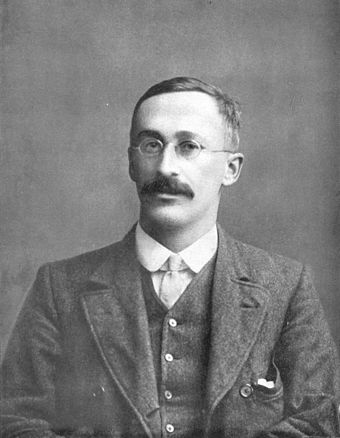

```{r, include = FALSE}
library(tidyverse)
library(mosaic)
library(infer)

sleep_hours <- read_csv("sleep_hours.csv")
```


Last class, we explored utilizing a bootstrap distribution to obtain a 
confidence interval for the population mean. There is another approach we could
have used instead, which focuses on mathematical formulas and not simulation. 

These "theory-based" mathematical formulas have a similar idea: 

> **Obtain a distribution of statistics we might have expected from other**
> **samples.**

This distribution has a special name, it is called a **sampling distribution**.
A sampling distribution is a *distribution of statistics* calculated for
different samples. This week, we are focusing on the mean. So, our sampling 
distribution will visualize the variability in sample means we would expect from
other samples. 

Last class, we created a sampling distribution using bootstrapping. We resampled
from our original data to create "new" samples we could have expected to obtain
from other samples of STAT 218 students. This class, we will instead use 
mathematical theory to obtain our sampling distribution. 

# Central Limit Theorem (CLT)

This key theorem in Statistics says that when we collect a "sufficiently large" sample of $n$ **independent** observations from a population with mean $\mu$
and standard deviation $\sigma,$ we know the **sampling distribution** of 
$\bar{x}$ will be nearly Normal with mean $\mu$ and standard deviation 
$\frac{\sigma}{\sqrt{n}}$. 

In order for us to feel confident that we can use the CLT with our data, we 
need to check two conditions:

- Independence of Observations
- Normality

\newpage

__1. Do you believe that the 50 observations collected in this sample are 
independent? Why or why not?__

\vspace{2cm}

__2. Based on the histogram from yesterday's activity, do you believe it is
safe to say that the distribution of hours slept is approximately Normal? Why
or why not?__

\vspace{2cm}

## The $t$-distribution

```{r, echo = FALSE, fig.width = 14}

```

The $t$-distribution became well known in 1908, in a paper in *Biometrika* 
published by William Sealey Gosset. Gosset published the paper under the
pseudonym "Student," which is why you sometimes hear the distribution called 
"Student's t." Gosset worked at the Guinness Brewery in Dublin, Ireland, and
was interested in the problems of small samples [(Wikipedia article)](https://en.wikipedia.org/wiki/Student%27s_t-distribution#History_and_etymology). 

If we believe the CLT can work for our data, mathematically we will use the 
$t$-distribution as an **approximation** for the sampling distribution. The
$t$-distribution is always centered at zero and has a single parameter:
**degrees of freedom**. The degrees of freedom describe exactly what the shape 
of the $t$-distribution looks like. 

\newpage

We will use a $t$-distribution with $n - 1$ degrees of freedom to model the
sample mean. When we have more observations, the degrees of freedom will be
larger and the $t$-distribution will look more like the Normal distribution. 

__3. How many degrees of freedom will we use for our $t$-distribution?__

\vspace{1cm}

__4. Compared to a $t$-distribution with 20 degrees of freedom, will your 
distribution have *more* or *less* area in the tails?__

\vspace{1cm}

The CLT says if we have a "large" sample of independent observations and don't
have any outliers, then we know the sampling distribution has a standard
deviation of $\frac{\sigma}{\sqrt{n}}.$ But, we don't usually know the value 
of $\sigma$, since it is the **population** standard deviation. So, instead 
we substitute in $s$, the sample standard deviation: $\frac{s}{\sqrt{n}}$.

```{r}
favstats(~ hours, data = sleep_hours)
```

__5. Given the summary statistics above, calculate the estimated standard
deviation of the sampling distribution (standard error).__

\vspace{2cm}

Did you notice that $\frac{\sigma}{\sqrt{n}}$ did not equal $s$? This is
because the variability between **individuals’** number of hours slept is 
**VERY** different from the variability between the **average** number of hours
slept across samples of people.

> **Key Idea:**
> **There will be less sample-to-sample variability than in person-to-person** 
> **variability!**

## Using the $t$-distribution to create a confidence interval

Previously, we found our confidence interval by finding different 
percentiles on our bootstrap distribution. For example, we used the 2.5th and
97.5th percentile to obtain a 95% confidence interval. 

When we are using a $t$-distribution to obtain our confidence interval, the 
process has similar ideas, but a slightly different approach. Since the 
$t$-distribution is centered at 0 and symmetric, the number associated with the
2.5th percentile and the 97.5th percentile **is the same**. Well, one is 
positive and one is negative, but they have the same numbers. So, we only need 
to find **one** number to make our confidence interval!

```{r, echo = FALSE, out.width = "50%", fig.align = "center"}
sleep_hours %>%
  specify(response = hours) %>% 
  hypothesize(null = "point", mu = 8) %>% 
  assume(distribution = "t") %>% 
  visualize() +
  labs(x = "t-statistic", 
       y = "Density", 
       title = "") +
  geom_vline(xintercept = -2.009575, 
             color = "red", 
             lwd = 1.5) +
  geom_vline(xintercept = 2.009575, 
             color = "red", 
             lwd = 1.5) + 
  annotate(geom = "text", 
           x = c(-2.2, 2.2),
           y = 0.35, 
           label = "t*", 
           size = 6) +
    theme(axis.title.x = element_blank(), 
        axis.text.x = element_blank(), 
        axis.ticks.x = element_blank())
```

The number we are finding is called the **multiplier**. The multiplier for a 
confidence interval depends on two things, (1) the degrees of freedom and (2)
the side of confidence interval you want. In our case we know we should use a
$t$-distribution with 49 degrees of freedom. 

__6. We are interested in making a 95% confidence interval. Using the table
below, circle the correct multiplier we should use to make our interval.__

| `R` code             | Value     |
|:---------------------|:---------:|
| `qt(0.90, df = 49)`  | 1.299069  |
| `qt(0.95, df = 49)`  | 1.676551  |
| `qt(0.975, df = 49)` | 2.009575  |
| `qt(0.995, df = 49)` | 2.679952  |


Now that we have the multiplier, we can put all of the pieces together! The
"formula" for a $t$-based confidence interval is:

$$\text{point estimate} \pm t^*_{df} \times SE$$

\vspace{2cm}

__7. Using your answers to questions 5 and 6, create a 95% confidence interval
for the mean hours slept for all STAT 218 students.__

\vspace{2cm}

__8. What do we hope is contained in this interval?__

\vspace{2cm}

__9. Do we know if the interval contains this value?__

\vspace{2cm}

__10. How do you interpret the interval you found?__

\vspace{2cm}
\vspace{2cm}

## Exploring Confidence Intervals

__11. Do you think a 90% confidence interval be wider or narrower than your 95%
confidence interval? Explain.__

\vspace{1cm}

__12. When you change from a 90% to a 95% confidence interval, which part of the
confidence interval is changing? (circle the correct answer)__

- Statistic (midpoint)
- Multiplier
- Standard error

__13. How does the multiplier change from the 95% to the 90% confidence
interval? (circle the correct answer)__

- Multiplier is larger
- Multiplier is smaller
- Multiplier stays the same

__14. How would the center change for a 99% confidence interval compared to
the 90% interval?__

\vspace{2cm}

__15. How would the standard error change for a 99% confidence interval compared
to the 90% interval? Explain.__

\vspace{2cm}

__16. How would the 95% confidence interval change if you surveyed a much
smaller number of students? Assume that the sample mean would still be 6.6.__

\vspace{2cm}


# Comparison with Previous Results

__17. What confidence interval did you obtain yesterday? Is it similar to or
different from the interval you obtained today?__

\vspace{2cm}

__18. Why do you think your intervals were different / similar?__

\vspace{2cm}

# Generalizability

__19.	Think again about how the sample was selected from the population. Do you
feel comfortable generalizing the results of your analysis to the population of
all STAT 218 students at your school? Explain.__

\vspace{2cm}

# Conclusions 

It’s important to keep in mind that these conditions are rough guidelines and
not a guarantee! All theory-based methods are approximations which work best
when the distributions are symmetric, when sample sizes are large, and when
there are no large outliers. When in doubt, use a simulation-based method as a
cross-check! If the two methods give very different results you should consult
a statistician!
