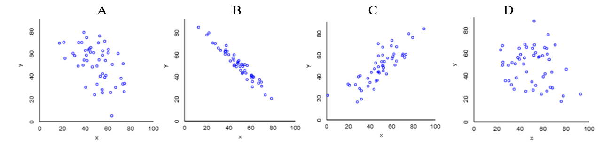
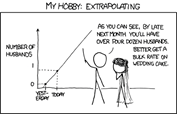

```{r setup, include = FALSE}
library(tidyverse)
library(mosaic)
library(infer)
library(moderndive)

set.seed(1234)

my_theme <- theme(axis.text = element_text(size = 16), 
                  axis.title = element_text(size = 18)
                  )

```

### Terminology review

In today's activity, we will use simulation-based methods for conducting a 
hypothesis test for a linear regression slope or correlation. Some terms covered
in this activity are:

* Correlation

* Slope 

* Regression line

### Diving Penguins

Emperor penguins are the most accomplished divers among birds, making routine
dives of 5–12 minutes, with the longest recorded dive over 27 minutes. These
birds can also dive to depths of over 500 meters! Since air-breathing animals
like penguins must hold their breath while submerged, the duration of any given
dive depends on how much oxygen is in the bird’s body at the beginning of the
dive, how quickly that oxygen gets used, and the lowest level of oxygen the bird
can tolerate. The rate of oxygen depletion is primarily determined by the
penguin’s heart rate. Consequently, studies of heart rates during dives can help
us understand how these animals regulate their oxygen consumption in order to
make such impressive dives. 

In this study, the researchers equipped emperor penguins with devices that
record their heart rates during dives. The data set reports Dive Heart Rate
(beats per minute), the Duration (minutes) of dives, and other related
variables.  Is there an association between dive heart rate and the duration of
the dive?

```{r data, include = FALSE}
diving <- read_csv(here::here("Week 4 - SLR", 
                              "activity",
                              "Diving_Penguins.csv")
                   )
```

### Vocabulary review

1. In this study, which variable will be on the x-axis? Is it the response
variable or the explanatory variable? Is it quantitative or categorical?

\vspace{1cm}

2. Which variable is on the y-axis? Is it the response variable or the
explanatory variable? Is it quantitative or categorical?

\vspace{1cm}

3. How is this study different from other studies we have considered? 
(Hint: consider the types of variables.)

\vspace{.5in}

### Exploratory Data Analysis

#### Visualizing the Relationship -- Scatterplot

A *scatterplot* is a graph showing a dot for each observational unit, where the
location of the dot indicates the values of the observational unit for both the
explanatory and response variables. Typically, the explanatory variable is
placed on the x-axis and the response variable is placed on the y-axis.

When describing a relationship or association between two quantitative variables
as seen through a scatterplot, we look for three aspects of association: form,
direction, and strength. 

- The __form__ of association between two quantitative variables is described by
indicating whether a line would do a reasonable job summarizing the overall
pattern in the data or if a curve would be better. It is important to note that,
especially when the sample size is small, you don’t want to let one or two
points on the scatterplot change your interpretation of whether or not the form
of association is linear. In general, assume that the form is linear unless
there is compelling (strong) evidence in the scatterplot that the form is not
linear.

- The __direction__ of association between two quantitative variables is either
positive or negative, depending on whether or not the response variable
(`Duration`) tends to increase (positive association) or decrease (negative
association) as the explanatory variable (`Dive_HeartRate`) increases.

- In describing the __strength__ of association revealed in a scatterplot, we 
see how closely the points follow a straight line or curve. If all the points
fall pretty close to this straight line or curve, we say the association is
strong. Weak associations will show little pattern in the scatterplot, and
moderate associations will be somewhere in the middle.

```{r eda, echo = FALSE, message = FALSE}
ggplot(data = diving, 
       mapping = aes(x = Dive_HeartRate, y = Duration)
       ) +  
  geom_point() +  
  labs(x = "Heart Rate (bpm)",  
       y = "Dive Duration (min)"
       ) 

```

2. Describe the association between the variables as revealed in the
scatterplot above. (Hint: Remember to comment on direction, strength, and form
of association as well as unusual observations. Also, make sure you use the
context of the study)

\vspace{2in}

#### Summarizing the Relationship -- Correlation

Describing the direction, form, and strength of association based on a
scatterplot, along with investigating unusual observations, is an important
first step in summarizing the relationship between two quantitative variables.
Another approach is to use a summary statistic. One of the statistics most
commonly used for this purpose is the **correlation coefficient**. When the
relationship has a roughly linear form, it’s strength and direction can be
quantified by the correlation. 

The sample correlation coefficient, denoted $r$, is a single number that takes a
value between -1 and 1, inclusive. Negative values of $r$ indicate a negative association, whereas positive values of $r$ indicate a positive association. It
is important to note that the correlation coefficient within a population is
denoted $\rho$ and $r$ is an estimate of $\rho$.

> __Key Idea:__
>The correlation coefficient is only applicable for data which has a linear
> form; non-linear data is not summarized well by the correlation coefficient. 
> In fact, we could say that the correlation coefficient is a numerical summary
> of the __strength__ and __direction__ of a linear association between two
> quantitative variables.

#### Some key ideas to remember 

- Correlation measures the relationship between a pair of variables; the
correlation is the same regardless of which one is explanatory and which is
response. (Be careful, the same is not true for regression!)

- Correlation is a number without units. It is not a percent!

- The stronger the linear association is between the two variables, the closer
the value of the correlation coefficient will be to either -1 or 1, whereas
weaker linear associations will have correlation coefficient values closer to 0.
Moderate linear associations will typically have correlation coefficients in the
range of 0.3 to 0.7, or -0.3 to -0.7.

- Correlation can be sensitive to outliers and extreme values of either
variable.

#### Calculating the Correlation

The correlation coefficient uses a rather complex formula that is rarely
computed by hand; instead, people almost always use a calculator or computer
to calculate the value of the correlation coefficient. We will use the
**moderndive** `R` package to obtain the correlation between two numerical
variables. Specifically, we will use the `get_correlation()` function to obtain
our sample correlation coefficient. 

The code will always look something like this:

```
get_correlation(data = <NAME OF DATASET>, 
                <Y-VARIABLE> ~ <X-VARIABLE>)
```

You will be responsible for (1) filling in the name of the dataset and (2)
filling in the names of the x-variable and y-variable. 

I've filled in the code for you to obtain our sample correlation

```{r cor}
get_correlation(data = diving, 
                Duration ~ Dive_HeartRate)
```

3. Interpret the correlation obtained. Is it positive or negative? What does
this imply about the relationship between the variables? Is it strong, moderate, 
or weak? How does this connect to what you saw in the scatterplot?

\vspace{2cm}

#### Extra Practice with Correlations




4. Assign the following values of r, the correlation coefficient, to the
datasets above.

<center>

-0.21, 0.83, -0.97, -0.5

</center>

5. Returning back to the penguins, say you had another observation at (25, 2.5),
as in a penguin with a heart rate of 25 beats per minute who dove for 2.5
minutes. How do you think this would change the correlation coefficient?

\vspace{1cm}

### Least Squares Regression 

6. If you knew the heart rate of a penguin, what might be a way to determine
how long you would expect for them to dive for based on the data?

\vspace{2cm}

Correlation measures strength of the association between two quantitative
variables when the sample data points tend to follow a straight line. A natural
question is then: what line do the points tend to follow? 

7. Based on the scatterplot, would you say that a straight line could summarize
the relationship between height and foot length reasonably well? 

\vspace{1cm}

8. Using the scatterplot below, draw the line you believe fits the data the 
best. 


```{r draw-line, echo = FALSE, message = FALSE}
ggplot(data = diving, 
       mapping = aes(x = Dive_HeartRate, y = Duration)
       ) +  
  geom_point() +  
  labs(x = "Heart Rate (bpm)",  
       y = "Dive Duration (min)"
       ) 

```

### Finding the "Best" Regression Line

Your regression line will be different from my regression line and from other
people in our class. There may be similarities, but no one will draw the exact
same line! So, how then do we decide what line is the "best"?

In statistics we use a method called "least squares." The idea is that we 
minimize the sum of the squared distances between each point and the line.
That's a mouthful! Let's visualize what this means. 

9. On your plot, draw the vertical distance between some of the points and the
line you drew. 

These vertical distances are how far off your estimated duration is from what 
was actually seen in the data. These values are called **residuals**. The least
squares method finds the line that minimizes the *square* of these residuals. 

10. When you square small residuals what happens?

\vspace{1cm}

11. When you square large residuals what happens?

\vspace{1cm}

#### Obtaining Coefficient Estimates from `R`

We will always use `R` to find the equation of the "best" regression line. 
Specifically, we will use the `lm()` function. The `lm` stands for
*linear model* --- the method we believe best models the relationship between
our two variables. 

The code will always look something like:

```
name_of_lm <- lm(<Y-VARIABLE> ~ <X-VARIABLE>, 
                 data = <NAME OF DATASET>)
```

In the context of these data, here is the code I used to find the regression 
line:

```{r lm, echo = TRUE}
diving_lm <- lm(Duration ~ Dive_HeartRate,
                data = diving)
```

Once we've told `R` to find the regression line, we need to obtain the estimated
coefficients that go with the line! To do this, we will use the 
`get_regression_table()` function from the moderndive package. 

```{r coef}
get_regression_table(diving_lm)
```


6. Using the output from the `R` code above, write the equation of the
regression line. Note that we’ve used variable names in the equation, not
generic x and y. And put a carat (“hat”) over the y variable name to emphasize
that the line gives predicted values of the y (response) variable.


$\widehat{\text{Dive Duration}} =$ _________ $+$ _________ $\times \text{(Heart Rate)}$

\vspace{1in}

Notation: The equation of the best fit line is written as
$\hat{y} = b_0 + b_1 \times \text{(x)}$ where

- $b_0$ is the intercept
- $b_1$ is the slope
- $x$ is a value of the explanatory variable
- $\hat{y}$ is the predicted value for the response variable

\vspace{0.5cm}

7. Is the slope positive or negative?  Explain how the sign of the slope tells
you about whether your data display a positive or a negative association.

\vspace{1in}

> __Key Idea:__
> For a given dataset, the signs (positive or negative) for the correlation
> coefficient and the slope of the regression line must be the same.

#### Interpreting the Coefficients

Let’s investigate what the slope means in the context of heart rate and 
dive duration. 

8. Use the least squares regression line to predict the diving duration for
penguins with a heart rate of height of 75 beats per minute. 

\vspace{1cm}

9. Use the least squares regression line to predict the diving duration for
penguins with a heart rate of height of 76 beats per minute. 

\vspace{1cm}

10. By how much do your predictions in #8 and #9 differ? Does this number look
familiar? Explain.

\vspace{1cm}

11. These questions above were designed to help you interpret the slope.
Interpret the slope in context:

The slope of the regression line predicting dive duration based on heart rate is
__________, meaning that for every additional _______ beat per minute increase
in heart rate, the predicted dive duration increases by _________ minutes.

\vspace{0.5cm}

> __Key Idea:__
> The slope coefficient of a least squares regression model is interpreted as
> the predicted change in the mean response (y) variable for a one-unit change
> in the explanatory (x) variable. 

Let’s investigate the meaning of the y-intercept in the context of dive duration
and heart rate. 

12. Use the least squares regression line to predict the diving duration for a
penguin with a heart rate of 0 bpm. 

\vspace{1cm}

13. Your answer to #12 should look familiar. What is this value?

\vspac{1cm}

> __Key Idea:__
> The y-intercept of a regression line is interpreted as the predicted value of
> the response variable when the explanatory variable has a value of zero.

#### Be cautious!

While we can make predictions using our least squares regression line, we should
always be wary of extrapolation in interpreting the intercept or other values
outside the original data range.

> __Key Idea:__
> Predicting values for the response variable for values of the explanatory
> variable that are outside of the range of the original data is known as
> extrapolation and can give very misleading predictions.

<center>

</center>

14. What was the lowest value of heart rate observed in these data?

\vspace{1cm}

15.	What heart rates do you believe would be an extrapolation?

\vspace{2cm}

### Coefficient of Determination

A quantity related to the correlation coefficient is called the coefficient of
determination or R-squared ($R^2$). The coefficient of determination ($R^2$) is
the percentage of total observed variation in the response variable that is
accounted for by changes (variability) in the explanatory variable. Keep in mind
that $R^2$, like correlation, requires that the relationship between the
explanatory and response variables is linear. $R^2$ values close to 1 or 100%
indicate that the explanatory variable is able to explain a large portion of the
variability in the response. 

We calculate $R^2$ by squaring the correlation. 

16. Calculate the coefficient of determination ($R^2$) for the relationship
between heart rate and dive duration. 

\vspace{1cm}

17. Complete the following statement to interpret what this value means in the
context of the data: 

The coefficient of determination is ________%, this means that ________% of the variation in penguin's ________________ is attributable to changes in their __________________________.
