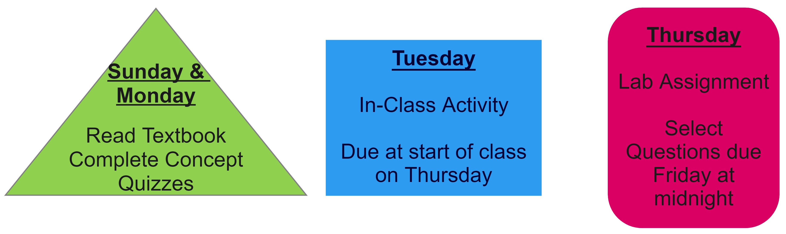
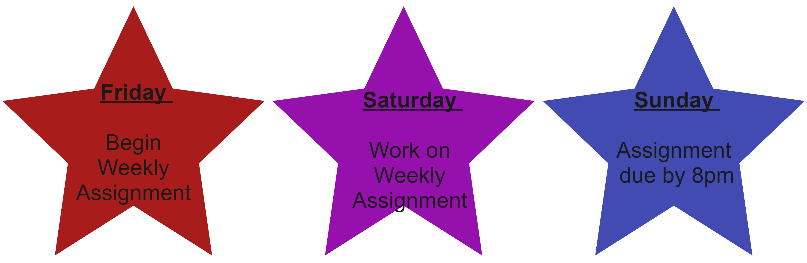

```{r setup, include=FALSE}
knitr::opts_chunk$set(echo = FALSE,
                      warning = FALSE, 
                      message = FALSE)

library(RColorBrewer)
library(tidyverse)

pal <- brewer.pal(n = 8, name = "Purples")
```


# {.tabset .tabset-fade}

## Instructor Contact Information

**Dr. Allison Theobold**

-	Email: atheobol@calpoly.edu
-	Office: Building 25 Office 105 (by Statistics Department Office) 

## Course Info

**Location:** Building 180, Room 272

**Times:** 9:10am - 11:00am

## Office Hours

| Day       | Time               |
|-----------|:------------------:|
| Tuesdays  | 2:30pm - 3:30pm (in-person) |
| Thursdays | 2:30pm - 3:30pm (in-person) |

If you would prefer to meet on Zoom, you are welcome to schedule an appointment
to meet here: <https://calendly.com/allisontheobold/office-hour-appointment> 

Zoom meetings are required to be scheduled at least 3-hours prior to the
meeting, so I know when I start teaching at 12:10 if I need to run back to my
office afterward for a meeting. 

---

# Course Resources {.tabset .tabset-fade}

For this course we will be using one main textbook, accompanied by additional 
resources. The textbooks we are using are free, but have the option to obtain 
a printed copy if you wish. 

## Textbooks 

{width=30%}

## Required Technology 

{width=15%}

{width=30%}

RStudio Cloud will be your resource for course lab assignments 

- data sets
- lab assignments
- group projects
- software resources

## Canvas

Canvas will be your resource for the course materials necessary for each week. 
There will be a published "coursework" page which you can access through RStudio
Connect. The page will walk you through what you are expected to do each week, 
including:

- textbook reading
- homework questions
- quiz questions

***Important***: Make sure you are receiving email notifications for *any*
Canvas activity. That includes: announcements, emails, comments, etc. In Canvas, click on your name, then Notifications. Check that Canvas
is using an email address that you regularly check; you have the option of
registering a mobile number. Check the boxes to get notifications for
announcements, content, discussions, and grades. 

## Writing & Learning Center 

There is free drop-in tutoring for 100- and 200-level math and stat courses
through the writing and learning center! 

The Writing and Learning Center offers virtual and in-person tutoring
appointments with four locations across campus and hours available daily Sunday
through Friday. For more information on our hours and locations, visit the
[Tutoring Hours](https://writingandlearning.calpoly.edu/hours) webpage.

---

# Welcoming Classroom

In my classroom, diversity and individual differences are respected,
appreciated, and recognized as a source of strength. Students in this class are
encouraged and expected to speak up and participate during class meetings, and
to carefully and respectfully listen to each other. During the first few weeks
of class, we’ll work together to create a set of norms that will govern our
interactions with each other, to ensure that we’re always respectful of
everyone. So that everyone feels comfortable participating, every member of
this class must show respect for every other member of this class. Any attitude
or belief that espouses the superiority of one group of people over another is
not welcome in my classroom. Such beliefs are directly destructive to the sense
of community that we strive to create, and will sabotage our ability to learn
from each other (and thus sabotage the entire structure of the course).

---

# Course description

Stat 218 is designed to engage you in the statistical investigation process
from developing a research question and data collection methods to analyzing and communicating results. This course introduces basic descriptive and inferential
statistics using both traditional (normal and $t$-distribution) and simulation
approaches including confidence intervals and hypothesis testing on means
(one-sample, two-sample, paired), proportions (one-sample, two-sample),
regression and correlation. You will be exposed to numerous examples of
real-world applications of statistics that are designed to help you develop a
conceptual understanding of statistics. 

After taking this course, you will be able to:

- Understand and appreciate how statistics affects your daily life and the
fundamental role of statistics in all disciplines.
- Evaluate statistics and statistical studies you encounter in your other
courses.
- Critically read news stories based on statistical studies as an informed
consumer of data.
- Assess the role of randomness and variability in different contexts.
- Use basic methods to conduct and analyze statistical studies using statistical
software.
- Evaluate and communicate answers to the four pillars of statistical inference:
How strong is the evidence of an effect? What is the size of the effect? How
broadly do the conclusions apply? Can we say what caused the observed
difference?

<!-- ### Cal Poly STAT 218 learning outcomes -->

<!-- 1. Use fundamental principles and techniques from statistics to determine -->
<!-- probabilities of events, interpret summary statistics and to carry out -->
<!-- statistical inferential procedures on real world data sets collected from a -->
<!-- variety of disciplines. -->


<!-- 2. Students will describe how variability arises indata collection, as well as -->
<!-- how sampling variability and sample size affect conclusions made from -->
<!-- statistical hypothesis tests and confidence intervals when these techniques are -->
<!-- used to answer research questions aboutthe world. -->


<!-- 3. Students will describe data collection plans and apply statistical  -->
<!-- inferential procedures, such as hypothesis tests and confidence intervals, to -->
<!-- answer research questions posed in other disciplines, as well as daily life.  -->

<!-- 4. Students will use appropriate statistical language to describe statistical -->
<!-- studies, as well as interpret data analysis results including summary statistics -->
<!-- and probabilities. -->

<!-- 5. Students will describe the biases present in different data collection plans, -->
<!-- as well as the type and limits on scope of conclusions in statistical -->
<!-- investigations. -->

<!-- 6. Students will write clear and logical descriptions of data collection plans, -->
<!-- as well as solutions for statistical inferential procedures in order to provide -->
<!-- quantitative justification for decision-making in a variety of disciplines. -->


### GE: Mathematics / Quantitative Reasoning

This course fulfills the B4: Mathematics / Quantitative Reasoning requirement of 
the General Education curriculum because learning probability and statistics
allows us to disentangle what's really happening in nature from “noise” inherent
in data collection. STAT 218 builds critical thinking skills which form the
basis of statistical inference, allowing students to evaluate claims from data. 

After completing an Area B4 course, students should be able to:

* Calculate and interpret various descriptive statistics

* Identify and describe data collection methods based on simple random sampling
or simple experimental designs

* Construct confidence intervals for a single mean, differences between means
for independent and paired samples, a single proportion, and the difference
between two proportions from independent samples, and interpret the results in
the context of the life sciences

* Formulate various decision problems in the life sciences in terms of
hypothesis tests.

* Calculate parametric hypothesis tests for the difference in two independent
sample means and two independent sample proportions, Chi-square goodness-of-fit,
Chi-square test for independence, and interpret the results in the context of
the life sciences.

* Calculate and interpret non-parametric hypothesis test for two independent
sample means.

* Describe relationships between two quantitative variables using simple linear
regression.

---
 
# Prerequisites

Entrance to STAT 218 requires at least one of the following be met:

- Grade of C- or better in MATH 115
- Grade of B or better in MATH 96
- appropriate placement on the 
[Math Placement Exam](https://math.calpoly.edu/mape)

You should have familiarity with computers and technology (e.g., Internet
browsing, word processing, opening/saving files, converting files to PDF format,
sending and receiving e-mail, etc.).
 
---
 
# Course Assessment

Your grade in STAT 218 will contain the following components:

```{r, echo = FALSE, warning = FALSE, message = FALSE, fig.align = "center"}
grades <- tribble(
  ~category,  ~percent,
  "Reading & Videos", 5,
  "Activities", 10,
  "Labs", 10,
  "Assignments", 15,
  "Midterm Project", 10, 
  "Midterm Exams (2)", 20,
  "Final Project", 15,
  "Final Exam", 15
) %>% 
  mutate(category = factor(category, 
                           levels = c(
                             "Reading & Videos",
                             "Activities",
                             "Labs",
                             "Assignments",
                             "Midterm Project",
                             "Midterm Exams (2)",
                             "Final Project",
                             "Final Exam")
                           )
         ) %>% 
  mutate(
    location = rep(1, 8) 
  )

grades %>% 
  ggplot(aes(x = location, y = percent)) +
  geom_col(aes(fill = category), col = 'black') + 
  guides(fill = "none") + 
  geom_text(aes(x = rep(1, 8), 
                label = c(
                  "Reading & Videos (5%)",
                  "Activities (10%)",
                  "Labs (10%)",
                  "Assignments (15%)",
                  "Midterm Project (10%)",
                  "Midterm Exams (20%)",
                  "Final Project (15%)", 
                  "Final Exam (15%)"
                  ), 
                y = c(98, 90, 80, 68, 55, 40, 24, 8)
                )
            ) + 
  labs(x = '', y = 'Cumulative percent') + 
  theme(axis.text.x = element_blank()) +
  scale_fill_manual(values = pal)
```

---
 
# Course Format & Organization
 
### Communication 

Every Sunday evening there will be an announcement on Canvas letting you know
what is due over the next week, and the material we will be covering. The module 
for each week will be released on Sunday by noon, so you can look over the 
content and see what the plan is for the week. 

We will use Canvas to manage questions and responses regarding course content. 
There are discussion forums for the different components of each week (e.g., 
Week 1 Lab Assignment). Please __do not__ send an email about homework questions
or questions about the course material. It is incredibly helpful for others in
the course to see the questions you have and the responses to those questions.
I will try to answer any questions posted to Canvas within 3-4 hours (unless 
it is posted at midnight). If you think you can answer another student’s
question, please respond! 

### Work Schedule

Generally, I will work from approximately 8am to 4pm during the week, and I will
only on Sundays. I will attempt to respond to emails in 24 hours, but emails
sent on Friday night or Saturday night may not be responded to until Monday
morning. If you don't hear back from me in 48 hours, assume I did not receive
your email and resend it!

### Weekly Layout
 
Each week in STAT 218 will, for the most part, look something like this:

```{r, fig.align = 'center'}




```

### Reading & Videos (5%)

You will be expected to complete the assigned textbook reading and course videos
prior to attending the in-class activity for each week. As you complete the 
reading and watch the videos, you should complete the concept check quiz
questions. You can retake the video quizzes as many times as you like (the most
recent grade will be recorded in Canvas) until the deadline.

* Concept check quizzes are due **Monday at 8pm Pacific Time each week**.
* The two lowest concept check quiz grades will be dropped.

### Activities (10%)

Monday's and Tuesday's classes will be dedicated to meeting with your
classmates and instructor to work through that week's group activity. Attendance
and completion of the activity counts towards this portion of your grade. 

* Printed activities will be provided for you on Tuesday, with Word and PDF 
files posted on Canvas

* Tuesday's activity will be checked for completion at the **beginning of class
on Thursday.** 

* If you have an excused absence the day the activity is due (e.g., quarantine
or ill), you may email Dr. Theobold a scanned copy of the completed activity for
credit. This must be received by **8pm on Thursday**.


### Labs (10%)

Every Thursday, you will meet with your classmates and instructor to work
through that week's Rstudio Cloud group lab.  The lab will reinforce the ideas
learned in the activity completed on Tuesday, through the use of R to
explore and analyze data.  

* Each group will turn in selected questions from the lab to Canvas. Labs are
due **Friday at 8pm Pacific Time each week**.
* Each student will also turn in the entirety of each lab for completion by 
**Sunday at 8pm**.

### Assignments (15%)

You will complete weekly assignments in **Canvas**. These should be completed
**individually** (meaning all answers should be written in your own words), but
you may use your classmates, tutors, or your instructor for assistance. 

* Weekly assignments are due **Sunday at 8pm**.

### Midterm & Final Projects (25%)

There will be two projects throughout the quarter, where you will be asked to 
apply the statistical concepts you have learned in the context of real data. 
Each of these projects will be done individually. More details will be provided
during class.

### Midterm exams (20%)

There will be two midterm exams, worth 20% of your course grade. The midterm
exams will be taken in class during your normal in-class time. Each exam has an
individual and group component.  

All eligible exam questions will be provided to you one week before the exam. 
The midterm exam will be a random selection of the questions you are provided. 
Solutions to the questions **will not** be posted. You are responsible for 
attending office hours and asking any clarifying questions you have. Because the
question bank will be provided to you, exams are closed book and
closed note. 

#### _Group portion_:

Group midterm exam 1 will be during the second half of class on **October 20**  

Group midterm exam 2 will be during the second half of class on **November 10**

* Group portions of the midterms are worth 20% of your overall midterm exam
grade.
* You will be provided with template "notecards" to assist you while completing
the exam.
* You **will** be required to use Rstudio on the group midterm exams.
* **If you miss more than 25% of class days within a unit without communicating
with your section instructor and group-mates, you must complete the group exam
individually.**

#### _Individual portion_:

Individual midterm exam 1 will be during the first half of class on 
**October 20**  

Individual midterm exam 2 will be during the first half of class on
**November 10**

* Individual portions of the midterms will be worth 80% of your overall midterm
exam grade.
* Potential individual midterm exam questions will be released one week prior to
the exam. 
* Individual midterm exams are closed book and closed notes.
* A formula sheet will be provided to use during the exam (also released with
the potential midterm exam questions).
* You will be allowed a calculator on the individual midterm exams. 
* You will **not** be required to use Rstudio on the individual midterm exams.


### Final exam (15%)

The individual final exam will be the same format as the midterm exams, with the
question bank published one week before the final. The final exam questions will
be divided as follows:

- 50% Final Exam Question Bank
- 25% Midterm 1 Question Bank
- 25% Midterm 2 Question Bank

#### _Group portion_:

Group final exam will be **Thursday, December 1 (during normal class time)**. 

* The group portion of the final exam will be worth 20% of your overall final 
exam grade.
* You will be provided with template "notecards" to assist you while completing
the exam.
* You **will** be required to use Rstudio on the group final exam.
* **If you miss more than 25% of class days in Unit 3 without communicating with your section instructor and group-mates, you must complete the group exam individually.**

#### _Individual portion_:

Individual final exam will be: **Saturday, December 3 from 10:10am to 1:00pm**. 

* The individual portion of the final exam will be worth 80% of your overall 
final exam grade.
* Potential final exam questions will be released one week prior to the exam.
* The individual final exam is closed book and closed notes. 
* You will be provided a one page formula sheet during the exam.
* You will be allowed a calculator on the individual final exam. 
* You will **not** be required to use Rstudio on the individual final exams.

---

# Working in Teams 

Working in teams is beneficial for *every* student, but only if each person
meaningfully engages in the discussions being had. Each of you will work in a
group of 3-4 students to discuss the course concepts and complete the course
activities and labs. 

By participating in this community, students accept to abide by the classroom 
Code of Conduct and accept the procedures by which any Code of Conduct incidents
are resolved. Any form of behavior to exclude, intimidate, or cause discomfort
is a violation of the Code of Conduct. In order to foster a positive
and professional learning environment we encourage the following kinds of
behaviors in all platforms and events:

- use welcoming and inclusive language
- everyone participates and no one dominates
- listen to understand
- share airtime
- one speaker at a time
- disagree with respect
- be respectful of different viewpoints and experiences
- all ideas are valid
- gracefully accept constructive criticism
- treat everything you hear as an opportunity to learn and grow
- seek common ground and understanding

---

# Late Work Policy 

Assignments  are expected to be submitted on time. However, every
student will be permitted to submit **one** individual assignment up to 24-hours
late without question. You do not need to contact me to use this allowance, but
if you find yourself in a position where you have used this allowance and you 
cannot complete another assignment by the due date, __you are expected to email me__. Once you email me, we can work together to find a deadline that is fair 
to both you and other students. If I do not hear from you, I will take a 5% reduction in score for every day an assignment is late, up to four days

You are also expected to participate in each week's team collaborations. I will
monitor your involvement through your course attendance. If you find that you
are unable to participate in the week's team collaborations, __please let your
team know and contact me__. Once you contact me, we can create a plan for how 
you can engage in the assignment.

If you need to miss a class due to illness, quarantine, or other extenuating
circumstances, please email Dr. Theobold and group-mates letting them know
**prior to the class meeting**.  You may participate in the lab or activity via
video conferencing if desired or you may complete the lab on your own. If
needed, I will determine an appropriate extension on the lab based on your
individual circumstances.

**Exams**: 

- Students that are in quarantine but healthy enough to take the exam should
email Dr. Theobold to arrange to take the exam at home while being proctored
via Zoom.

- If you are ill to the point of not being able to take the exam, please email
Dr. Theobold to arrange a time to take the exam remotely via Zoom when you are
feeling better within the week of the exam.

- Students who miss the exam without contacting the Dr. Theobold prior to the
exam will receive a zero on the exam.

- Work is not a legitimate reason for an exam absence.

---
 
# Policy on academic misconduct

Students in an academic setting are responsible for approaching all assignments
with rigor, integrity, and in compliance with the University Code of Student
Conduct. Students	are	expected to	be good citizens and to	engage in responsible
behaviors that reflect well	upon their university, to	be civil to	one	another
and	to others	in	the	campus community,	and	contribute positively	to student
and	university life.	

It is expected that students adhere to the following responsibilities: 

1. consult and analyze sources that are relevant to the topic of inquiry;

2. acknowledge when they draw from the ideas or the phrasing of those sources
in their own writing;

3. learn and use appropriate citation conventions within the field in which they
are studying; and

4. ask their instructor for guidance when they are uncertain of how to
acknowledge the contributions of others in their thinking and writing.

When students fail to adhere to these responsibilities, they may intentionally
or unintentionally "use someone else’s language, ideas, or other original (not
common-knowledge) material without properly acknowledging its source" [http://www.wpacouncil.org](http://www.wpacouncil.org). When the act is
intentional, the student has engaged in plagiarism.

Plagiarism is an act of academic misconduct, which carries with it consequences
including, but not limited to, receiving a course grade of “F” and a report to
the Office of the Dean of Students. Unfortunately, it is not always clear if the
misuse of sources is intentional or unintentional, which means that you may be
accused of plagiarism even if you do not intentionally plagiarize. If you have
any questions regarding use and citation of sources in your academic writing,
you are responsible for consulting with your instructor before the assignment
due date. In addition, you can work with an Writing Center tutor at any point
in your writing process, including when you are integrating or citing sources.

**In STAT 218, students involved in plagiarism on assignments (all parties involved) will receive a zero grade on that assignment. The second offense will result in a zero on that assignment, and the incident will be reported to the Office of Students Rights and Responsibilities. Academic misconduct on an exam will result in a zero on that exam and will be reported to the Dean of Students, without exception.**

---

# Policy on intellectual property

This syllabus, course lectures and presentations, and any course materials
provided throughout this term are protected by U.S. copyright laws.  Students
enrolled in the course may use them for their own research and educational
purposes.  However, reproducing, selling or otherwise distributing these
materials without written permission of the copyright owner is expressly
prohibited, including providing materials to commercial platforms such as Chegg
or CourseHero.  Doing so may constitute a violation of U.S. copyright law as
well as Cal Poly’s Code of Student Conduct.
