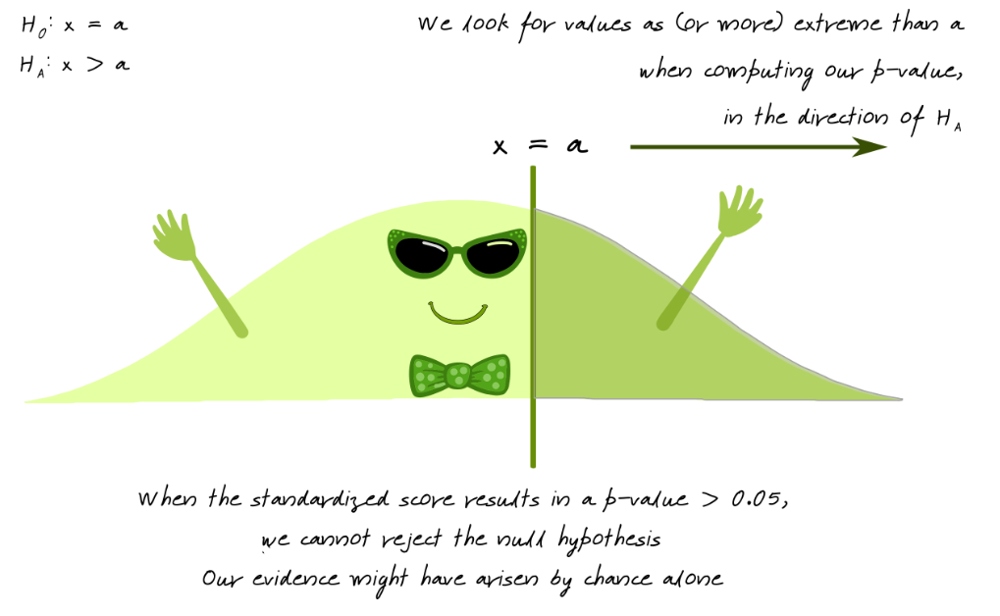
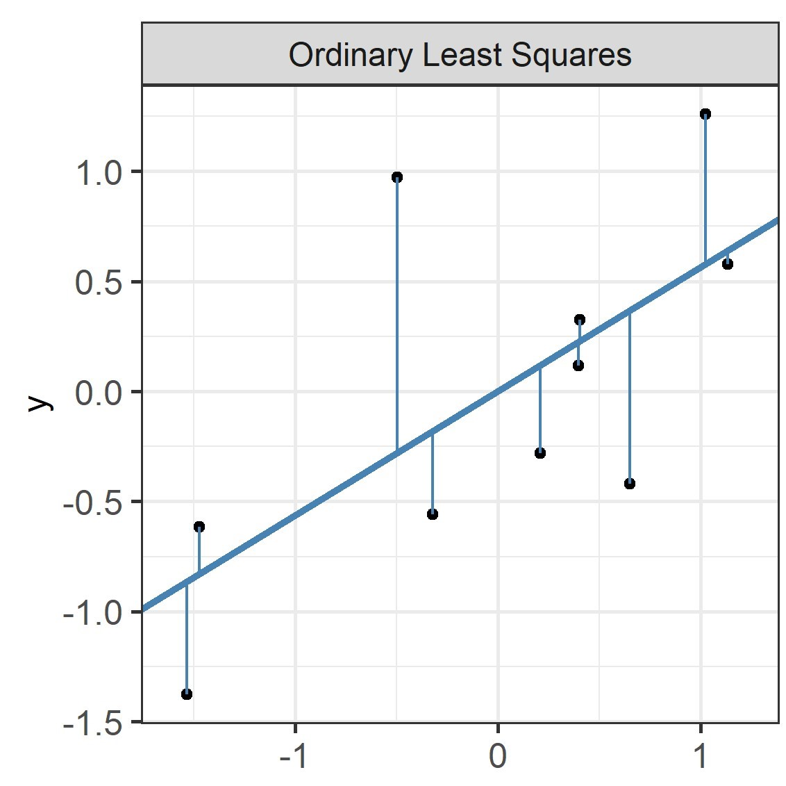
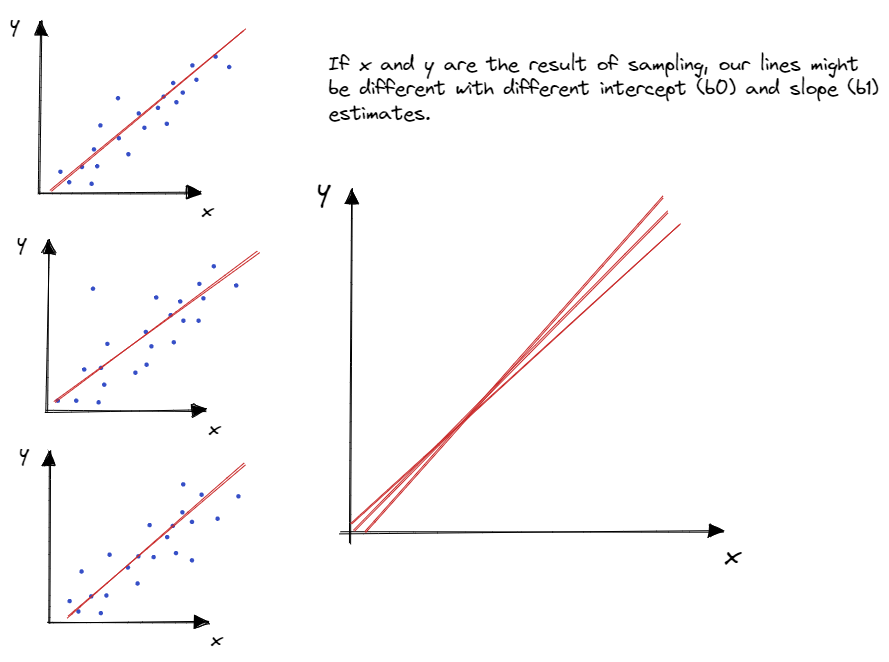
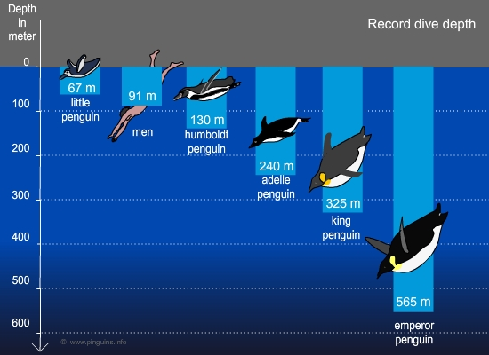

class:title-slide-custom

<style>
p.caption {
  font-size: 0.8em;
}
</style>

```{r, child = "style.Rmd"}
```


```{r setup, echo = FALSE, message = FALSE, warning = FALSE}

# Packages
library(emoji)
library(tidyverse)
library(gridExtra)
library(scales)
library(knitr)
library(kableExtra)
library(iconr)
library(fontawesome)
library(readr)
library(patchwork)

# R markdown options
knitr::opts_chunk$set(echo = FALSE, 
                      message = FALSE, 
                      warning = FALSE, 
                      cache = FALSE,
                      fig.align = 'center',
                      dpi = 300)
options(htmltools.dir.version = FALSE)
options(knitr.kable.NA = '')
```

```{r, include = F, eval = T, cache = F}
clean_file_name <- function(x) {
  basename(x) %>% str_remove("\\..*?$") %>% str_remove_all("[^[A-z0-9_]]")
}
img_modal <- function(src, alt = "", id = clean_file_name(src), other = "") {
  
  other_arg <- paste0("'", as.character(other), "'") %>%
    paste(names(other), ., sep = "=") %>%
    paste(collapse = " ")
  
  js <- glue::glue("<script>
        /* Get the modal*/
          var modal{id} = document.getElementById('modal{id}');
        /* Get the image and insert it inside the modal - use its 'alt' text as a caption*/
          var img{id} = document.getElementById('img{id}');
          var modalImg{id} = document.getElementById('imgmodal{id}');
          var captionText{id} = document.getElementById('caption{id}');
          img{id}.onclick = function(){{
            modal{id}.style.display = 'block';
            modalImg{id}.src = this.src;
            captionText{id}.innerHTML = this.alt;
          }}
          /* When the user clicks on the modalImg, close it*/
          modalImg{id}.onclick = function() {{
            modal{id}.style.display = 'none';
          }}
</script>")
  
  html <- glue::glue(
     " <!-- Trigger the Modal -->

<!-- The Modal -->
<div id='modal{id}' class='modal'>
  <!-- Modal Content (The Image) -->
  
  <!-- Modal Caption (Image Text) -->
  <div id='caption{id}' class='modal-caption'></div>
</div>
"
  )
  write(js, file = "js-addins.html", append = T)
  return(html)
}
# Clean the file out at the start of the compilation
write("", file = "js-addins.html")
```

<br><br>
# INTRODUCTION TO DATA & STATISTICAL INFERENCE
## Stat 218: Applied Statistics for the Life Sciences
#### California Polytechnic State University - San Luis Obispo
<!-- ##### `r fa("github", fill = "black")` [Course GitHub Webpage](https://earobinson95.github.io/stat218-calpoly) -->

---
class:inverse
# Tuesday, OCTOBER 11, 2022

 Today we will...

+ Statistical Inference Recap

+ Big Picture on Simple Linear Regression

+ Activity 4: Diving Penguins
  + Checked for engagement and completion in class Thursday

---
class: primary
# STATISTICAL INFERENCE RECAP

**Big Idea:** Hypothesis testing gives us the framework to formally use statistical methods to draw inferences about our entire population from our collected data.

1. Research question
  + Set up your context
  + Write your hypotheses/claims
2. Find evidence against your claims
  + p-values
  + confidence intervals (also can just help us describe our data)
3. Make a decision about your claim
4. Interpret your results in context of the research question

---
class: primary
# SETUP

**Setup**
+ Observational Units
+ Variable of Interest (and type)
+ Population of Interest
+ Parameter (has a symbol - last week $\mu$ (Mu) for the true population mean)
  + think of this as a "word formula" (summary statistic + variable of interest + population)

**Hypotheses**

+ $(H_O)$ Null: "innocent", "nothing is going on", "status quo" (= Null Value)
+ $(H_A)$ Alternative: "guilty", "something is going on", "what we are trying to prove" (<, >, $\ne$)

---
class: primary
# STATISTICALLY SIGNIFICANT

Let's find evidence!

1. **Simulation**
  + Bootstrapping: repeated sampling with replacement
  + Randomization: we will do this today (we actually did this on day 1 of class!)
2. **Theory/Math**
  + We know certain properties of these distributions
  
  
**Distributions**

+ Observed Data
+ Sampling Distribution (Either from Bootstrapping or from Theory)
+ Null Distribution (Either from Randomization or from Theory)
  
---
class: primary
# STATISTICAL SIGNIFICANCE

How strong is our evidence? How much evidence do we need?

| $\alpha$-threshold | Confidence Level |
| -------------------|------------------|
| 0.10 | 90% |
| 0.05 | 95% |
| 0.01 | 99% |

We set our **significance level** at the beginning of a study.


---
class: primary
# P-VALUES

This is the probability of seeing your observed summary statistic (from your data) IF the null is true (aka assuming "nothing is going on").

Compare this to our null distribution (either randomization or theory)

If the data from your sample seems unusual compared to this, then we have evidence!

+ p-value $\le \alpha$ $\implies$ reject the null hypothesis and claim **we have** evidence in favor of the alternative hypothesis
+ p-value $> \alpha$ $\implies$ fail to reject the null hypothesis and claim **we do not have** evidence in favor of the alternative hypothesis.

*Note: We NEVER accept the null hypothesis*

---
class: primary
# P-VALUES

```{r, fig.cap = "", fig.alt = "P-value logic: An image of a green distribution.", out.width = "85%"}

```

---
class: primary
# TWO-SIDED P-VALUES

```{r, fig.cap = "", fig.alt = "P-value logic: An image of a green distribution.", out.width = "85%"}
knitr::include_graphics("images/two-sided-test.png")
```

---
class: primary
# CONFIDENCE INTERVALS

.pull-left[

We have our **point estimate** from our observed summary statistic from our sample (this is our "best guess" for our population parameter).

**Goal:** Find a range of plausible values for our parameter (point estimate + uncertainty).

].pull-right[

```{r, fig.cap = "", fig.alt = "P-value logic: An image of a green distribution.", out.width = "85%"}

```

]

---
class: primary
# CONFIDENCE INTERVALS

**How do we find them?** Use the quantiles (could call these percentiles) on from the **sampling distribution** either from bootstrapping or theory.

$$\text{point estimate} \pm \text{multiplier} \times \text{SE}$$


$$\bar x \pm t^*_{df} \times \frac{s}{\sqrt n}$$

+ If the interval falls completely above or below the **null value** $\implies$ reject the null and conclude evidence in favor of the alternative!

+ If the interval falls contains the **null value** $\implies$ fail to reject the null and conclude we do not have evidence in favor of the alternative!

---
class:primary
# WHAT'S NEW?

.pull-left[
**Last week**

+ ONE quantitative/numerical variable
+ Summarize with measures of
  + center
      + mean/average, median/middle
  + spread
      + standard deviation - sd, inner quartile range - IQR = Q3 - Q1
+ Visualize with: Dot-plots, histograms, box-plots

].pull-right[
**This week**

+ TWO quantiative/numerical variables
+ Summarize with correlation (r) - measures strength of relationship/association
+ Visualize with scatterplots
]


---
class:primary
# SIMPLE LINEAR REGRESSION

The principle of simple linear regression is to find the line (i.e., determine its equation) which passes as close as possible to the observations, that is, the set of points.

```{r linear-regression, echo = F, fig.width = 6, fig.height = 9/2, out.width = "50%", fig.align='center'}
library(ggplot2)
library(magrittr)
library(plyr)

set.seed(2)
corrCoef = 0.5 # sample from a multivariate normal, 10 datapoints
dat = MASS::mvrnorm(10,c(0,0),Sigma = matrix(c(1,corrCoef,2,corrCoef),2,2))
dat[,1] = dat[,1] - mean(dat[,1]) # it makes life easier for the princomp
dat[,2] = dat[,2] - mean(dat[,2])

dat = data.frame(x1 = dat[,1],x2 = dat[,2])

dat %>%
ggplot(aes(x1,x2))+
  geom_point()+
  coord_equal()+
  scale_x_continuous("x") +
  scale_y_continuous("y") +
  theme_bw(base_size = 14) +
  theme(aspect.ratio = 1,
        legend.position = "none",
        axis.text    = element_text(size = 12),
        axis.title   = element_text(size = 12),
        legend.title = element_blank(),
        legend.key.size = unit(1, "line")
        )
```

---
class:primary
# SIMPLE LINEAR REGRESSION

The principle of simple linear regression is to **find the line** (i.e., determine its equation) which passes as close as possible to the observations, that is, the set of points.

```{r linear-regression2, echo=F, fig.align='center', fig.height=9/2, fig.width=6, message=FALSE, warning=FALSE, out.width="50%"}
dat %>%
ggplot(aes(x1,x2))+
  geom_point()+
  geom_abline(intercept = -0.1, slope = 0.8, color = "black", linetype = "solid") +
  geom_abline(intercept = 0, slope = 0.4, color = "black", linetype = "solid") +
  geom_abline(intercept = -0.2, slope = 1.1, color = "black", linetype = "solid") +
  coord_equal()+
  scale_x_continuous("x") +
  scale_y_continuous("y") +
  theme_bw(base_size = 14) +
  theme(aspect.ratio = 1,
        legend.position = "none",
        axis.text    = element_text(size = 12),
        axis.title   = element_text(size = 12),
        legend.title = element_blank(),
        legend.key.size = unit(1, "line")
        )
```

---
class:primary
# SIMPLE LINEAR REGRESSION

The principle of simple linear regression is to **find the line** (i.e., determine its equation) **which passes as close as possible to the observations**, that is, the set of points.

.pull-left[
```{r linear-regression3, echo=F, fig.align='center', fig.height=9/2, fig.width=6, message=FALSE, warning=FALSE, out.width="80%"}
dat %>%
ggplot(aes(x1,x2))+
  geom_point()+
  geom_smooth(method = "lm") +
  coord_equal()+
  scale_x_continuous("x") +
  scale_y_continuous("y") +
  theme_bw(base_size = 14) +
  theme(aspect.ratio = 1,
        legend.position = "none",
        axis.text    = element_text(size = 12),
        axis.title   = element_text(size = 12),
        legend.title = element_blank(),
        legend.key.size = unit(1, "line")
        )
```
].pull-right[

**Equation of a line** (y = mx + b):

+ Estimated from sample: $\hat y = b_0 + b_1\times x$
+ Population true line: $y = \beta_0 + \beta_1 \times x + error$

*Recall how $\bar x$ was our point estimate for $\mu$.*

]

**Big Idea:** We use least squares regression (aka math) to find the "best" line.

---
class:primary
# RESIDUALS

Difference between observed points and predicted value (line) for the same $x$ value.

.center[

]

---
class:primary
# INFERENCE FOR SLOPE

.pull-left[
```{r, fig.cap = "", fig.alt = "", out.width = "100%"}

```
]
.pull-right[
**Goals:**

1. Test whether there is an association between $x$ and $y$
2. Give a confidence interval for the true population slope
]

---
class:primary
# INFERENCE FOR SLOPE

**Null:** The true slope between $x$ and $y$ for the population is equal to 0 $(H_O: \beta_1 = 0)$


**Alternative:** The true slope between $x$ and $y$ for the population is different than 0 $(H_A: \beta_1 \ne 0)$

Then we look for evidence (p-values & confidence intervals)!

+ Simulation - Randomization to create our null distribution
+ Theory

---
class: primary
# DIVING PENGUINS

[Diving Penguins](https://earobinson95.github.io/stat218-calpoly/04-simple-linear-regression/activity/activity4-diving-penguins.html)

.center[
```{r, fig.cap = "", fig.alt = "", out.width = "50%"}

```
]

Image from: [https://www.pinguins.info/Engels/Voortdiepte_eng.html](https://www.pinguins.info/Engels/Voortdiepte_eng.html)
