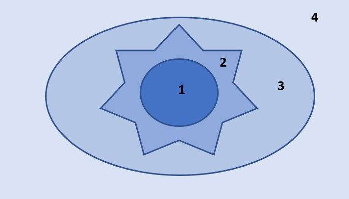

```{r, include = FALSE}
knitr::opts_chunk$set(echo = FALSE, 
                      warning = FALSE, 
                      message = FALSE)

library(tidyverse)
library(knitr)
library(readxl)

guesses07 <- read_xlsx(here::here("Week 1 - Intro to Data", 
                                "activity",
                                "handout",
                                "correct_guesses.xlsx"), 
                     sheet = "07")

guesses09 <- read_xlsx(here::here("Week 1 - Intro to Data", 
                                "activity",
                                "handout",
                                "correct_guesses.xlsx"), 
                     sheet = "09")
```

## Remembering back...

In week one of this course we did an activity exploring if you could correctly
identify the letters of the Martian alphabet. You were presented with the two
figures below and asked to decide which was "Bouba" and which was "Kiki" 
(Ramachandran, 2007). 


We tabulated how many students correctly guessed that "Kiki" was the figure on
the left. Next, we simulated what we would have expected to see if everyone was
randomly guessing which figure went with which word. 

1. If everyone was randomly guessing, what would be the probability of correctly
identifying "Kiki"? 

\newpage 

Today, we are going to investigate how we could use statistical inference to 
determine how often we would expect to get a statistic like the one we got on 
Day 1 of the class, if everyone was just randomly guessing. 

## Chi-Squared Goodness-of-fit Test

Specifically, we will be carrying out what is called a "Chi-Squared
goodness-of-fit test." The big idea behind this test is to compare what 
proportions we would have expected to get under the null hypothesis to what we
actually got. 

In our case, we are assuming that there is an equal chance at guessing correctly
or incorrectly. 

2. So, under $H_0$, what would the values of $p$ be? 

| Correct Guess   | Incorrect Guess |
|-----------------|-----------------|
|  $p$ =          |   $p$ =         |
|                 |                 |

3. If the table above represents what is assumed to be true under $H_0,$ what 
do you believe the alternative hypothesis would be?

\vspace{0.25in}


### Chi-Squared Statistic 

The idea behind the Chi-Squared statistic is to compare the frequencies (of 
correct and incorrect guesses) we observed to what we would have expected to see
if $H_0$ was true. 

This calculation requires two pieces of information:

- $p$ 
- sample size

Once we have each of these, we can create a table of what frequencies we would
have expected to see if $H_0$ was true. 

4. Fill out the expected table below!


| Expected # of Correct Guesses | Expected # of Incorrect Guesses |
|-------------------------------|---------------------------------|
|                               |                                 |
|                               |                                 |

\newpage

Next, we compare each of our observed frequencies to what we would have expected
if $H_0$ was true. We compare how far "off" our observed frequencies are from 
what was expected in a very specific way, using the following calculation:

$$
\frac{(\text{observed} - \text{expected})^2}{\text{expected}}
$$
This formula should look similar to calculating the percent change, except that
we are squaring the numerator. 

5. Fill out the table for our class' observed frequencies. 

| Observed # of Correct Guesses | Observed # of Incorrect Guesses |
|-------------------------------|---------------------------------|
|                               |                                 |
|                               |                                 |

6. Using the formula above, calculate how far "off" the observed frequencies for
our class' guesses are from what we expected under $H_0$. 

\vspace{1in}

By adding the two values from #5 together, you have the Chi-Squared (or $X^2$) 
statistic! 

7. Calculate the value of the $X^2$ statistic for our classes guesses. 

$X^2 =$

\vspace{0.25in}

8. Take another look at the $X^2$ formula. What type of statistics will we 
**always** obtain? 
*Hint:* These statistics are similar to the ANOVA F-statistic!

\vspace{0.25in}

## Sampling Distribution of $X^2$ Statistics

In order for us to calculate our p-value---the probability of observing an $X^2$
statistic as or more extreme than we got, if the null was true---we need a 
distribution of $X^2$ statistics that could have happened if $H_0$ was true.

Like all of our previous topics, there are two ways we can obtain this 
**sampling distribution**:

- using computer simulation
- using mathematical theory

Let's see how each of these works! 

\newpage

## Simulated / Permuted Null Distribution

On Day 2 of class we simulated a distribution of **proportions** that could have
happened under the null hypothesis. Today, we are turning our attention to how
simulating what **$X^2$** statistics we could have gotten if the null hypothesis
was true.

\vspace{0.25in}

To carry out **one** simulation we need to do the following steps:

__Step 1:__ Specify what value of $p$ is assumed under $H_0$:  

\vspace{0.25in}

__Step 2:__ Specify how many **trials** should be used when flipping a coin:  

\vspace{0.25in}

__Step 3:__ Specify which response goes with each side of a coin:  

\vspace{0.25in}

__Step 4:__ Flip a coin (or simulate flipping a coin) the number of times 
specified in Step 2. Tabulate how many responses went in each category:

| Simulated # of Correct Guesses | Simulated # of Incorrect Guesses |
|--------------------------------|----------------------------------|
|                                |                                  |
|                                |                                  |

\vspace{0.25in}

__Step 5:__ Calculate the $X^2$ statistic for the simulation

\vspace{0.25in}

__Step 6:__ Plot the simulated $X^2$ statistic on the distribution

\vspace{0.25in}

Alright, after carrying out this process, I obtained the following distribution.

```{r null-X2, cache = TRUE, out.width = "60%"}

get_null_X2 <- function(n){
  rerun(n, 
        tibble(sample = sample(c("Y", "N"), 
                               size = 11, 
                               replace = TRUE
                              )
               ) %>% 
          count(sample) %>%
        rename(observed = n) %>% 
        mutate(expected = 5.5,
               X2 = (observed - expected)^2 / expected
               ) %>% 
        distinct(X2) %>% 
        pull()
  ) %>% 
  flatten_dbl() 
}

get_null_X2(1000) %>% 
  tibble(X2 = .) %>% 
  ggplot(mapping = aes(x = X2)) +
  geom_histogram() +
  labs(x = "Simulated X2 Statistic", 
       y = "Number of Simulations") +
  theme_bw()

```

\newpage

9. Draw a line where the observed $X^2$ statistic falls on this distribution.

\vspace{0.25in}

10. Estimate the p-value for testing if we were all randomly guessing which 
figure was "Kiki."

\vspace{0.25in}

11. Based on your p-value, what would you conclude for your null and alternative
hypotheses from #2 and #3?

\vspace{0.5in}

## Theory-based Null Distribution

For the Chi-Squared goodness-of-fit test we've been discussing, it can be
mathematically shown that the distribution of $X^2$ statistics is approximately
a $\chi^2$ distribution with $k - 1$ degrees of freedom. Similar to an ANOVA, 
$k$ represents the number of groups in our response variable.

Degrees of freedom represent the amount of "free" information in a given
situation. In our situation, we have two groups, so $k - 1$ would be 1. Since 
we have two proportions and we know they must sum to 1, only one proportion is 
"free" or unconstrained. Once I know the proportion of the time someone would 
guess incorrectly, I also know the proportion of time they would guess
correctly!

### The $\chi^2$ Distribution

A $\chi^2$ distribution behaves similar to an F-distribution with two respects, 
(1) it only has positive values and (2) the shape of the distribution is 
controlled by degrees of freedom. Below are three different $\chi^2$ 
distributions, which look quite different. They have very different shapes
because they different degrees of freedom! 

\vspace{0.25in}

```{r chi-squared, out.width = "60%"}
x <- c(0, seq(0.0000001, 40, 0.05)
       )
DF <- c(2, 4, 9)

y <- list()
for (i in 1:length(DF)) {
  y[[i]] <- dchisq(x, DF[i])
}
plot(0, 0,
  type = "n",
  xlim = c(0, 25),
  ylim = range(c(y, recursive = TRUE)),
  axes = FALSE, 
  ylab = "",
  yaxt = "n"
)
for (i in 1:length(DF)) {
  lines(x, y[[i]],
    lty = i,
    col = case_when(i == 1 ~ "light blue",
                    i == 2 ~ "blue",
                    i == 3 ~ "black"),
    lwd = 1.5 + i / 2
  )
}
abline(h = 0)
abline(v = 0)
axis(1)
legend("topright",
  lwd = (1.5 + 1:4) / 2,
    col = c("light blue",
            "blue",
            "black"),
  lty = 1:4,
  legend = paste(round(DF)),
  title = "Degrees of Freedom",
  cex = 1
)
```

### Conditions for Using a $\chi^2$ Distribution

In order for the $\chi^2$ distribution to be a good approximation of the true
sampling distribution, we need to verify two conditions:

- The observations are independent
- We have a "large enough" sample size 
  * This is checked by verifying there are at least 5 expected counts in each
  cell

If the condition about expected cell counts is violated, we are forced to use
a simulation-based method (like we just did).

12. Are the conditions for using a $\chi^2$ distribution to approximate the 
sampling distribution violated?

\vspace{0.5in}

### Using a $\chi^2$ Distribution to Find the p-value

If we decided in #12 that it is not unreasonable for us to use the $\chi^2$
distribution, then we can use `R` to find our p-value. 

We will use the `pchisq()` function, which has three inputs:

- the observed $X^2$ statistic
- how many degrees of freedom should be used for the $\chi^2$ distribution
- if the lower tail (left tail) should be used when calculating the p-value

13. Using the values you calculated before and your intuition, fill in the 
code below:

```{r chi-sq-p-value, echo = TRUE, eval = FALSE}
pchisq(_____, df = _____, lower.tail = ______)
```

\vspace{0.25in}

Running the code you just wrote in `R` gave me a p-value of
`r pchisq(7.36, df = 1, lower.tail = FALSE)`. 

14. Based on this p-value what conclusion would you reach regarding the null
hypothesis?

<!-- pchisq(7.36, df = 1, lower.tail = FALSE) -->

\vspace{0.5in}

15. Did you reach similar conclusions using simulation-based methods? Why do 
you believe that is the case?

\vspace{1in}

\newpage

## Deer Habitat & Fire 

In the previous example, we had two options in our response variable: a correct
choice or an incorrect choice. The wonder of the goodness-of-fit test is that
it can be scaled up many possible response options! 

Take, for example, the relationship between deer habitat and fires. It is
interesting to investigate if deer behave differently (by grazing in certain
areas) after a fire. Six months after a fire burned 730 acres of deer habitat, researchers in the Forest Service surveyed a 3,000-acre parcel of land
surrounding the burn. 

They divided the area into four sections:

1. The region nearest to the heat of the burn
2. The inside edge of the burn
3. The outside edge of the burn 
4. The area outside of the burned area



\vspace{0.25cm}

The researcher are interested to know if the deer show a preference for certain
areas of the parcel. Under the null hypothesis, the deer would show no 
preference for any specific area and are randomly distributed across the 3,000
acres. 

Under the null hypothesis, if deer were randomly distributed over the 3,000 
acres, we would expect the frequencies of deer to be proportional to the size of 
the region. 

16. Fill in the table below with the proportions for the inner burn area and
the outer edge.

| Region         | Acres | Proportion of Total Area |
|----------------|-------|--------------------------|
| Inner Burn     | 520   |                          |
| Inner Edge     | 210   | 0.070                    |
| Outer Edge     | 240   |                          |
| Outer Unburned | 2,030 | 0.677                    |

\vspace{0.25in}

These proportions are the null hypothesis! 

17. What would be the alternative hypothesis?
*Hint:* Think about an ANOVA, what was the alternative hypothesis when the null
hypothesis said that all of the means were equal?

\vspace{0.5in}

Researchers observed a total of 75 deer in the 3,000 acre parcel. The table 
below shows how many deer were observed in each of the four areas. 

18. Using the proportions calculated above, determine the number of expected 
deer for each region. 


| Region         | Observed Counts | Expected Counts |
|----------------|-----------------|-----------------|
| Inner Burn     | 2               |                 |
|                |                 |                 |
| Inner Edge     | 12              |                 |
|                |                 |                 |
| Outer Edge     | 18              |                 |
|                |                 |                 |
| Outer Unburned | 43              |                 |


\vspace{0.25in}

19. Now, calculate the $X^2$ statistic for these data. 

\vspace{1in}

20. Which distribution should be used to find the p-value for this test 
statistic? 

\vspace{0.25in}

21. Suppose the p-value for the $X^2$ statistic you calculated in #19 was 
less than 0.0001. What conclusion could the researchers conclude about the 
distribution of deer on the parcel?

\vspace{1in}
